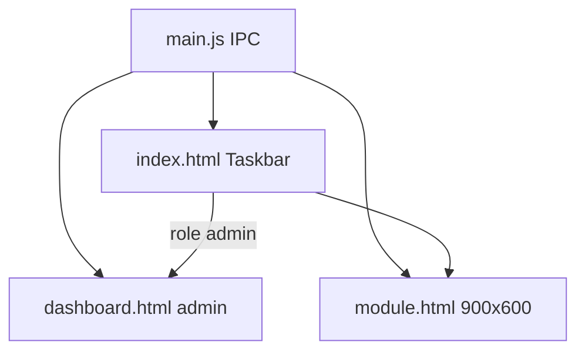

# Architecture — PharmaOS unifié

## 1. Stack
Application Electron unique à la racine `PharmaOs/` :

| Couche | Techno |
|--------|--------|
| Desktop | Electron 32 (`electron/main.js` ESM, `preload.cjs`) |
| UI | React 18 JSX, Vite 5 (`base: './'`, 3 entrées HTML) |
| Style | Tailwind CSS + lucide-react |
| BaaS | Supabase JS v2 — schémas `PharmaOs` + `portail` |
| Packaging | electron-builder (NSIS + portable) |

Variables : `VITE_SUPABASE_URL`, `VITE_SUPABASE_ANON_KEY` (voir `.env.example`). Pas de `service_role`.

## 2. Trois fenêtres



- **Taskbar** : frameless, always-on-top, modes `login` | `expanded` | `reduced`
- **Module** : une fenêtre réutilisée, hash `#view`, IPC `module:change-view`
- **Dashboard** : ouverte via `window:openDashboard` — **admin only**

## 3. Arborescence `src/`

- `core/` — `AuthContext` (session + `display_name` + `role`), `config.js`
- `shell/` — Login, Taskbar, DashboardShell, navConfig
- `shared/` — supabaseClient, windowService, dbServices
- `modules/<domaine>/` — comptoir + dashboard + services + sql

Source de migration : `../PharmaOs-legacy/` (App + Dashboard).

## 4. Auth & rôles
- Auth : `supabase.auth` (email / mot de passe)
- Profil : `portail.profiles` → `display_name`, `role` (`admin` | `équipe`)
- Taskbar : bouton LayoutDashboard **uniquement** si `role === 'admin'`
- DashboardShell : gate `isAdmin` ; sinon « Accès refusé »

## 5. Démarrage

```bash
cd PharmaOs
cp .env.example .env   # renseigner les clés anon
npm install
npm run electron:dev
```

Build packaging : `npm run dist` (phase packaging).

## 6. Hors scope v1
- UI Dashboard **équipe** — voir `DASHBOARD_EQUIPE.md`
- Migration complète des modules métier (phases suivantes)
