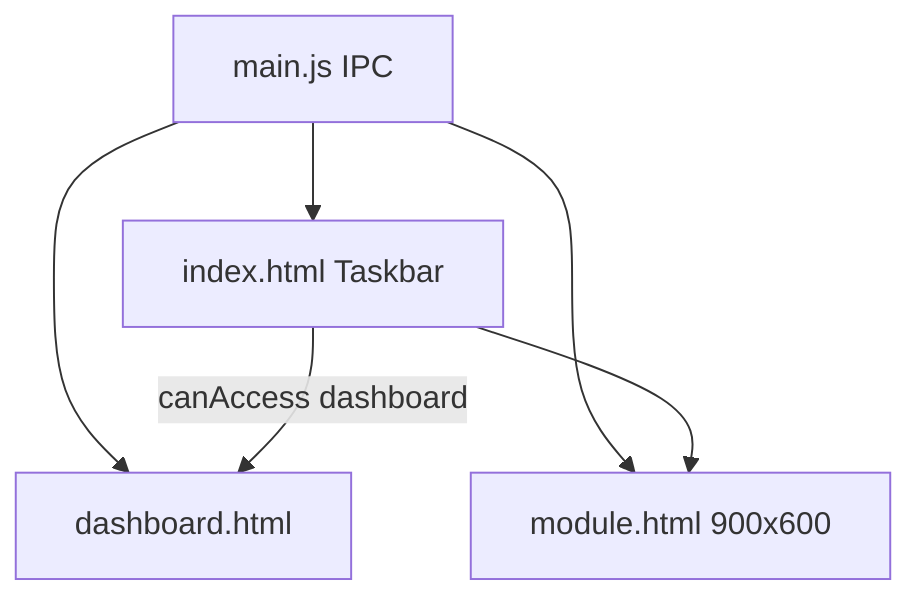

# Architecture — PharmaOS unifié

## 1. Stack

| Couche | Techno |
|--------|--------|
| Desktop | Electron (`electron/main.js` ESM, `preload.cjs`) |
| UI | React 18 JSX, Vite 5 (`base: './'`, entrées HTML) |
| Style | Tailwind CSS + lucide-react |
| BaaS | Supabase JS v2 — schémas `PharmaOs` + `portail` + `bdm` |
| Packaging | electron-builder (NSIS + portable) |

Variables : `VITE_SUPABASE_URL`, `VITE_SUPABASE_ANON_KEY` (voir `.env.example`). Pas de `service_role` client.

## 2. Surfaces UI



- **Taskbar** : frameless, always-on-top, modes `login` | `expanded` | `reduced`
- **Module** : une fenêtre réutilisée, hash `#view`, IPC `module:change-view` / `module:before-close`
- **Dashboard** : `window:openDashboard` + `dashboard:navigate` — accès via matrice `role_access` + casquettes
- **Bug** : `bug.html` → insert `PharmaOs.bugs`

## 3. Arborescence `src/`

- `core/` — AuthContext, `access.js` (`canAccess`), `roles.js`, widgets
- `shell/` — Login, Taskbar, DashboardShell, navConfig, BugReport
- `shared/` — supabaseClient, **windowService** (seul pont IPC), logService, dbServices
- `modules/<domaine>/` — comptoir + dashboard + services + sql

Modules notables : `inbox` (À traiter / mes saisies), `conseil`, `bdm`, `stupefiants`, `location`, `magistral`, `admin`.

Ancien module `rental/` **supprimé** (supersédé par `location/`).

## 4. Auth & accès

- Auth : `supabase.auth` (email / mot de passe) — **gestion compte sur le Portail Application**
- Profil : `portail.profiles` → `display_name`, `role` (`pharmacien` | `administrateur` | `préparateur` | `désactivé`)
- Accès UI : `canAccess(surface, featureId)` = matrice `role_access` **OU** grants casquette
- Taskbar Dashboard : ssi `canAccess('dashboard','dashboard')`
- Stupéfiants / autres modules : **mêmes gates** `canAccess` (pas de rôle en dur)

## 5. Contexte texte / LGO

Bus `electron/contextText/` : `FocusedTextSource` (Bloc-notes), `ClipboardSource`, stub `WinPharmaSource`.
Pont CIP LGO natif : **en attente d’infos** — clipboard reste la voie actuelle.

## 6. Démarrage

```bash
cd PharmaOs
cp .env.example .env
npm install
npm run electron:dev
```

Packaging : `npm run dist`.

## 7. Projet Supabase

Projet partagé `kpjflntnotftpzffjbud` — schemas Postgres dédiés. Projet 100 % dédié plus tard.
Ne pas dropper `phieevreux` / `valorisation` / `public` depuis PharmaOs.
