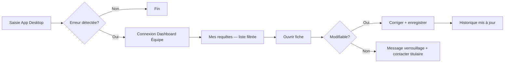

# 👥 Vision — Dashboard Équipe (correction des requêtes)

Document de cadrage pour un **espace web dédié au rôle `équipe`**, distinct du dashboard titulaire (`admin`). Objectif principal : permettre à chaque membre de l’équipe de **consulter et corriger ses propres saisies erronées**, sans accès à la supervision globale ni aux actions réservées au titulaire.

> S’appuie sur : `ARCHITECTURE.md`, `SECURITY.md`, `STATE.md`, `convention.mdc`.

---

## 1. Problème actuel

| Constats | Impact |
|----------|--------|
| Le Dashboard web n’accepte que `portail.profiles.role = 'admin'` | Un compte `équipe` voit `AccessDenied` même s’il est authentifié |
| L’App Desktop permet la **création** (appels, IP, qualité, litiges, stock…) mais peu ou pas la **correction** après coup | Une erreur de saisie oblige à solliciter le titulaire ou laisse une trace incorrecte |
| RLS : lecture/insertion isolées par `user_id` sur les logs personnels ; **UPDATE souvent absent ou réservé admin** | Même avec une UI équipe, les corrections échoueraient silencieusement (0 rows) |
| Services App déjà orientés « mes données » (`fetchMyQualityEvents`, `fetchMyDisputes`, `fetchMyStockErrors`…) | Bonne base réutilisable côté Dashboard, sans réinventer les requêtes |

**Besoin métier exprimé :** *« Modifier toutes leurs requêtes si erronées »* — périmètre **strictement personnel**, pas une vue équipe entière.

---

## 2. Objectifs et non-objectifs

### Objectifs

1. **Autocorrection** : l’utilisateur `équipe` corrige ses propres enregistrements dans un délai et des statuts autorisés.
2. **Traçabilité ISO** : toute modification est horodatée ; champs sensibles verrouillés une fois validés par le titulaire.
3. **Cohérence stack** : même SPA Dashboard (`PharmaOs/Dashboard/`), même auth Supabase, services isolés dans `src/services/`.
4. **Complémentarité App** : l’App reste le canal de saisie rapide au comptoir ; le Dashboard équipe = **file de correction** (écran plus large, clavier, relecture).

### Non-objectifs (restent admin)

- Statistiques globales, exports, clôture globale des tâches
- CRUD annuaire, agenda complet, GED, RH, validation stock/retrait lot
- Lecture ou modification des saisies **d’un autre** membre
- Suppression définitive des traces qualité / appels (audit)

---

## 3. Persona et parcours

**Persona :** préparateur(ice) ou assistant(e) — rôle `équipe`, utilisateur quotidien de la Taskbar App.



**Parcours type :**

1. Connexion email/mot de passe (identique Login actuel).
2. Gate auth : `role ∈ ['équipe']` → espace équipe ; `role = 'admin'` → dashboard titulaire existant ; autre → `AccessDenied`.
3. Accueil **« Mes requêtes »** : compteurs par type + alertes « corrigeable / verrouillée ».
4. Navigation par onglet ou filtre : Appels, IP, Qualité, Litiges, Stock, etc.
5. Édition inline ou panneau latéral (même pattern que `CallTracking.jsx` admin).
6. Retour à l’App sans déconnexion (session partagée Supabase).

---

## 4. Périmètre des « requêtes » corrigeables

Regroupement par table Supabase (`PharmaOs`), clé propriétaire, et règles de modification proposées.

| Domaine | Table | Clé propriétaire | Champs corrigeables (équipe) | Verrouillage |
|---------|-------|------------------|------------------------------|--------------|
| Appels | `call_logs` | `user_id` | `type`, `contact_id`, `contact_nom`, `numero`, `motif`, `statut_traitement`, `notes_appel`, `duree_secondes` | Admin a validé (`statut_traitement = cloture` + > 7 j) → lecture seule |
| Act-IP | `act_ip_logs` | `user_id` | Patient (initiales, âge, sexe), médecin, médicament, problème, type intervention, transmission, commentaires | `statut_ip = Cloturee` → lecture seule |
| Qualité | `quality_events` | `user_id` | `type`, `severity`, `data.*` (description, action immédiate, lieu, médicament) | `status ∈ {cloture}` ou CAPA engagée → lecture seule |
| Litiges | `supplier_disputes` | `created_by` | `dispute_type`, fournisseur, montant, description, pieces | `statut = clos` → lecture seule |
| Erreur stock | `stock_errors` | `user_id` | médicament, CIP, quantités, description | `status ≠ ouvert` ou tâche admin traitée → lecture seule |
| Périmés | `perimes` | `created_by` | champs déclaration (produit, quantité, DLC…) | statut validé admin |
| Magistrales | `magistral_orders` (ou équivalent) | `created_by` | détails commande non préparée | statut ≥ « en préparation » |
| MDS / PSL | `psl_movements` | `user_id` | commentaire, quantité **si** mouvement du jour non consolidé | export mensuel clos |
| Location | `rental_events` | `user_id` | détails événement non facturé | contrat clos |
| Caisse | clôtures | `user_id` | montants **avant** validation titulaire | clôture validée |
| Tâches (QuickAction) | `tasks` + `task_assignments` | `tasks.created_by` / assignation | `titre`, `description` JSON **si** créateur ; commentaire assignation **si** assigné | Tâche clôturée globalement |
| Agenda lié | `agenda_events` | via `details.taskId` + créateur tâche | `date_evenement`, `details` **si** lié à sa tâche et non passé | événement passé ou lié tâche d’autrui |

> **Principe :** une requête n’est modifiable que si `(propriétaire = auth.uid()) ET (statut métier = ouvert/en attente) ET (délai ≤ fenêtre configurable, ex. 30 jours)`.

Les services App `fetchMy*` et insert existants servent de **contrat de colonnes** — ne pas inventer de champs (`convention.mdc`).

---

## 5. Expérience utilisateur (écrans)

### 5.1 Layout équipe (allégé)

Réutiliser `AppLayout` avec une **navigation réduite** (`teamNavConfig.js`) :

| Section | Entrées |
|---------|---------|
| Accueil | Mes requêtes (vue agrégée) |
| Saisies courantes | Appels, Act-IP, Qualité, Litiges |
| Opérations | Stock, Périmés, Contrôles, Magistrales, MDS, Location, Caisse |
| Compte | Profil (display_name), déconnexion |

Pas de sidebar « Administration », pas de `UrgentAlertsBar` titulaire (ou version allégée : uniquement **mes** tâches urgentes assignées).

### 5.2 Page d’accueil — « Mes requêtes »

```
┌─────────────────────────────────────────────────────────────┐
│  Mes requêtes                          [Filtrer ▼] [30 j]  │
├─────────────────────────────────────────────────────────────┤
│  ┌──────────┐ ┌──────────┐ ┌──────────┐ ┌──────────┐       │
│  │ 3        │ │ 1        │ │ 0        │ │ 2        │       │
│  │ Appels   │ │ Qualité  │ │ IP       │ │ Litiges  │       │
│  │ corrigeab│ │ corrigeab│ │ verrouill│ │ corrigeab│       │
│  └──────────┘ └──────────┘ └──────────┘ └──────────┘       │
├─────────────────────────────────────────────────────────────┤
│  Liste unifiée (tri : plus récent)                          │
│  ● Appel — Dr Martin — motif erroné      [Corriger]  il y a 2h │
│  ● NC Qualité — presqu'erreur            [Corriger]  hier      │
│  🔒 IP — Clôturée                        [Voir]      12/08     │
└─────────────────────────────────────────────────────────────┘
```

- Badge **Corrigeable** (vert) / **Verrouillée** (gris) / **Expirée** (orange, délai dépassé).
- Clic → page module dédiée ou drawer d’édition.

### 5.3 Pattern d’édition

Aligné sur `CallTracking.jsx` (admin) :

- Liste filtrée `user_id = session.user.id` (côté service, pas dans le composant).
- Bouton « Modifier » → formulaire avec champs autorisés uniquement.
- Champ optionnel **« Motif de correction »** (texte court) → stocké dans `data.correction_note` ou colonne `updated_at` + journal si table audit ajoutée plus tard.
- Pas de bouton Supprimer sur qualité/appels/IP (conformité trace).

### 5.4 Messages d’erreur explicites

| Cas | Message UI |
|-----|------------|
| RLS refuse UPDATE | « Cette requête ne peut plus être modifiée (validée ou délai dépassé). Contactez le titulaire. » |
| Statut verrouillé | « Enregistrement clôturé — consultation seule. » |
| Donnée d’un autre user | Ne doit jamais apparaître (filtrage service + RLS). |

---

## 6. Architecture technique

### 6.1 Auth et routing

**Fichier pivot :** `Dashboard/src/core/AuthContext.jsx`

```text
ALLOWED_ROLES_ADMIN  = ['admin']
ALLOWED_ROLES_TEAM   = ['équipe']   // trancher définitivement vs 'member' (cf. STATE.md TODO)

isAuthorizedAdmin = session && role === 'admin'
isAuthorizedTeam  = session && role === 'équipe'
```

**Router (`App.jsx`) :**

```text
!authenticated     → Login
admin              → PAGES admin (existant)
équipe             → TEAM_PAGES (nouveau)
autre              → AccessDenied
```

Deux registres de pages : `PAGES` (admin) et `TEAM_PAGES` (équipe). Certaines pages peuvent **partager des composants** (ex. formulaire appel) avec props `readOnly` / `scope="own"`.

### 6.2 Services

Nouveau fichier **`teamCorrectionService.js`** (ou découpage par domaine miroir admin) :

| Fonction | Rôle |
|----------|------|
| `fetchMyRequestsSummary(userId)` | Agrégation compteurs + dernières lignes |
| `fetchMyCallLogs(userId, filters)` | `.eq('user_id', userId)` |
| `updateMyCallLog(userId, id, patch)` | UPDATE + vérif propriété côté requête |
| `fetchMyIpLogs` / `updateMyIpLog` | idem |
| `fetchMyQualityEvents` / `updateMyQualityEvent` | réutiliser contrats App |
| … | un `updateMy*` par table corrigeable |

**Règle convention :** aucun `.from()` dans les pages équipe — tout passe par `src/services/`.

### 6.3 Réutilisation App ↔ Dashboard

| Élément | Stratégie |
|---------|-----------|
| Contrats colonnes / enums | Dupliquer les constantes (`QUALITY_TYPES`, `DISPUTE_TYPES`, statuts) ou extraire plus tard un package partagé — **hors scope v1** |
| Logique `fetchMy*` App | Porter ou copier vers Dashboard services (même requêtes Supabase) |
| UI formulaires App | S’inspirer des champs ; Dashboard = version « correction » plus complète |

L’App **ne duplique pas** le dashboard : lien optionnel futur « Corriger sur le web » (ouvre URL Dashboard avec hash/query `?focus=call&id=…`).

---

## 7. Sécurité et RLS

### 7.1 Modèle d’autorisation (double couche)

1. **Applicative (Dashboard)** : navigation et champs masqués selon `role` et statut.
2. **RLS (Supabase)** : filet obligatoire — l’équipe ne peut SELECT/UPDATE **que** ses lignes.

### 7.2 Policies à ajouter / étendre (projet distant)

Pour chaque table corrigeable, pattern recommandé :

```sql
-- SELECT : propriétaire OU admin
(auth.uid() = user_id OR is_admin())

-- UPDATE : propriétaire ET statut ouvert ET (optionnel) created_at > now() - interval '30 days'
(auth.uid() = user_id AND status_ouvert(...) AND NOT is_admin_only_lock(...))
OR is_admin()
```

Tables prioritaires v1 : `call_logs`, `act_ip_logs`, `quality_events`, `supplier_disputes`, `stock_errors`.

**Documenter le résultat dans `SECURITY.md`** après déploiement (cf. TODO STATE).

### 7.3 Rôle canonique

**Décision à trancher :** `équipe` (utilisé dans QuickAction, hrService, stockService) vs `member` (commentaire AuthContext / contrainte SQL legacy).

→ **Recommandation :** normaliser sur **`équipe`** partout (App, Dashboard, RLS, contrainte `profiles.role`).

### 7.4 Ce que l’équipe ne doit jamais pouvoir faire (RLS)

- UPDATE `task_assignments` d’un autre `user_id` (sauf sa propre ligne, déjà prévu)
- UPDATE `tasks` dont `created_by ≠ auth.uid()`
- SELECT logs d’un collègue
- DELETE sur tables d’audit

---

## 8. Phasage proposé

### Phase 1 — MVP correction (priorité haute)

- [ ] Auth bi-rôle (admin | équipe) + layout équipe
- [ ] Page « Mes requêtes » agrégée
- [ ] Modules : **Appels**, **Act-IP**, **Qualité**, **Litiges**
- [ ] Services `fetchMy*` / `updateMy*` + policies RLS associées
- [ ] Tests manuels : correction OK, verrouillage statut, autre user invisible

### Phase 2 — Opérations étendues

- [ ] Stock, Périmés, Contrôles, Magistrales, MDS, Location, Caisse
- [ ] Édition tâches/agenda créés via QuickAction (créateur uniquement)
- [ ] Lien depuis App (optionnel)

### Phase 3 — Qualité de service

- [ ] Champ « motif de correction » + affichage admin (traçabilité)
- [ ] Notifications titulaire si correction sur NC critique
- [ ] Export « mes saisies » PDF pour l’utilisateur

---

## 9. Indicateurs de succès

| Métrique | Cible |
|----------|-------|
| Taux de corrections sans intervention titulaire | ↑ mesurable via `updated_at > created_at` |
| Erreurs RLS (0 row updated) en prod | 0 après phase 1 |
| Temps moyen correction | < 2 min (UX inline) |
| Tickets « corriger saisie » au titulaire | ↓ |

---

## 10. Risques et mitigations

| Risque | Mitigation |
|--------|------------|
| UPDATE RLS manquante | Checklist par table avant merge ; test avec compte `équipe` réel |
| Fraude / altération post-clôture | Verrouillage statut + pas de DELETE ; admin conserve override |
| Divergence App / Dashboard | Contrats enums documentés ; services miroir |
| Confusion admin vs équipe | URLs ou titres distincts : « PharmaOS — Espace équipe » vs « Dashboard titulaire » |
| Rôle `member` vs `équipe` | Migration unique profils + contrainte SQL |

---

## 11. Synthèse

Le **Dashboard Équipe** n’est pas un dashboard allégé du titulaire : c’est un **portail de correction personnel**, branché sur les mêmes tables que l’App Desktop, avec :

- **Périmètre** : mes requêtes uniquement ;
- **Moment** : tant que le statut métier est ouvert et dans la fenêtre de délai ;
- **Architecture** : même SPA Dashboard, double gate rôle, services dédiés, nav réduite ;
- **Sécurité** : RLS propriétaire + règles de verrouillage, admin inchangé pour supervision et validation.

Prochaine étape d’implémentation recommandée : **Phase 1** — auth bi-rôle + Appels/Qualité (volume d’erreurs probablement le plus élevé au comptoir).
