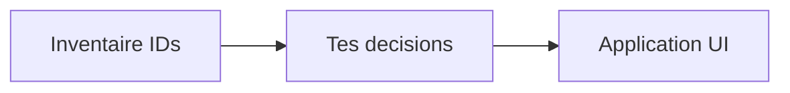

# Inventaire textes d’aide PharmaOs — décisions à prendre

Pour chaque ID, réponds avec une action parmi :

- **tooltip** — réduire en `title` / icône `?` au survol
- **bandeau** — garder (ou passer) en bandeau Information
- **supprimer**
- **garder** (tel quel)
- **reformuler** (+ nouveau texte souhaité)

Hors périmètre (non listés) : tooltips a11y des boutons icônes (taskbar, ✎/C/P), messages d’erreur/accès refusé, loaders, toasts purement techniques d’échec, données métier live (`Fin calculée : …`), placeholders **exemples** (`Ex. …`, `Pharmacie Dupont`).

---

## Admin / Paramètres


| ID     | Où                                                                                      | Type actuel   | Texte                                                                                   |
| ------ | --------------------------------------------------------------------------------------- | ------------- | --------------------------------------------------------------------------------------- |
| ADM-01 | [SettingsManager.jsx](src/modules/admin/dashboard/SettingsManager.jsx) sous-titre       | intro         | « Pharmacie (général), modules métier et templates mail. »                              |
| ADM-02 | [GeneralSettingsPanel.jsx](src/modules/admin/dashboard/GeneralSettingsPanel.jsx) haut   | intro         | « Identité de l’officine — préremplissage formulaires, impressions et templates mail… » |
| ADM-03 | Général → Adresse                                                                       | hint          | « Une ligne ou plusieurs »                                                              |
| ADM-04 | Général → toast save                                                                    | toast         | « … utilisées par tous les modules »                                                    |
| ADM-05 | [MailTemplatesSettings.jsx](src/modules/admin/dashboard/MailTemplatesSettings.jsx) haut | intro         | « E-mails transactionnels de toute l’application — objet, corps HTML et masques {…}. »  |
| ADM-06 | Mails → bandeau masques (repliable)                                                     | bandeau+outil | « Masques disponibles » + « Cliquez un masque… Format `{nom}` » + chips clé+libellé     |
| ADM-07 | Mails → corps HTML                                                                      | hint          | « Utilisez les masques du bandeau ci-dessus »                                           |
| ADM-08 | Mails → sous template                                                                   | hint          | « Destinataire type : … »                                                               |
| ADM-09 | [AccessManager.jsx](src/modules/admin/dashboard/AccessManager.jsx) haut                 | intro         | Rôles portail + casquettes + distinction « gestionnaire » Location                      |
| ADM-10 | Accès → section assignation tâches                                                      | intro         | Explication Jamais / Immédiat / Après délai + « Survolez l’icône ? »                    |
| ADM-11 | Accès → édition casquette                                                               | intro         | « Features (taskbar + dashboard) — catalogue fixe… »                                    |
| ADM-12 | Accès → HelpCircle tâches                                                               | tooltip       | `taskCatalog.description` (catalogue ~30 tâches)                                        |
| ADM-13 | [BugsManager.jsx](src/modules/admin/dashboard/BugsManager.jsx)                          | intro         | « Signalements équipe : date, auteur… »                                                 |
| ADM-14 | [LogsManager.jsx](src/modules/admin/dashboard/LogsManager.jsx)                          | intro         | « Journal détaillé : actions interface, auth… »                                         |


---

## Magistrales


| ID     | Où                                                                                            | Type       | Texte                                                                       |
| ------ | --------------------------------------------------------------------------------------------- | ---------- | --------------------------------------------------------------------------- |
| MAG-01 | [MagistralSettingsPanel.jsx](src/modules/magistral/dashboard/MagistralSettingsPanel.jsx) haut | intro      | « Sous-traitant & création — identité pharmacie dans Paramètres → Général » |
| MAG-02 | Paramètres → formes couvertes                                                                 | hint       | « Séparées par des virgules »                                               |
| MAG-03 | Paramètres → Création dossier                                                                 | bandeau    | « Cochez Actif… Obligatoire… (hors brouillon). »                            |
| MAG-04 | [MagistralManager.jsx](src/modules/magistral/dashboard/MagistralManager.jsx)                  | intro      | « Donneur d’ordre → sous-traitant unique · BPP §7 »                         |
| MAG-05 | [MagistralCreate.jsx](src/modules/magistral/comptoir/MagistralCreate.jsx)                     | intro      | « Prestataire : {nom} ({email}) » — *contexte config, pas pure aide*        |
| MAG-06 | [MagistralDevis.jsx](src/modules/magistral/comptoir/MagistralDevis.jsx)                       | intro      | Parcours « 1) Devis ST → 2) Appel patient → … »                             |
| MAG-07 | [MagistralRappel.jsx](src/modules/magistral/comptoir/MagistralRappel.jsx)                     | intro      | « Contrôle BPP à la réception, puis appel patient… »                        |
| MAG-08 | [MagistralDispenser.jsx](src/modules/magistral/comptoir/MagistralDispenser.jsx)               | intro      | « Dossiers à dispenser · ordonnancier DO + feuille de suivi »               |
| MAG-09 | [MagistralRenouvellement.jsx](src/modules/magistral/comptoir/MagistralRenouvellement.jsx)     | intro      | « Rechercher un dossier passé, prévisualiser, puis renouveler… »            |
| MAG-10 | [MagistralOrderForm.jsx](src/modules/magistral/shared/MagistralOrderForm.jsx) Nature          | hint       | « Commande = envoi direct ST. Devis = devis ST puis accord patient. »       |
| MAG-11 | Formule                                                                                       | hint       | « Saisie lisible pour le prestataire »                                      |
| MAG-12 | Poids                                                                                         | hint       | « Recommandé en pédiatrie »                                                 |
| MAG-13 | Téléphone patient                                                                             | hint       | « Affiché à la réception pour l’appel »                                     |
| MAG-14 | E-mail patient                                                                                | hint       | « Notification complémentaire »                                             |
| MAG-15 | Ordonnance                                                                                    | hint       | « Stockée dans le bucket magistral-ordonnances »                            |
| MAG-16 | Case préparation interne                                                                      | label aide | « … (rare — pas d’e-mail prestataire) »                                     |
| MAG-17 | [MagistralAdminEdit.jsx](src/modules/magistral/shared/MagistralAdminEdit.jsx) port            | hint       | « Utilisé au recalcul du TTC… »                                             |
| MAG-18 | [MagistralReceptionCall.jsx](src/modules/magistral/shared/MagistralReceptionCall.jsx) port    | hint       | « Sinon frais port des paramètres »                                         |


---

## Location (Phie)


| ID     | Où                                                                        | Type        | Texte                                                                             |
| ------ | ------------------------------------------------------------------------- | ----------- | --------------------------------------------------------------------------------- |
| LOC-01 | [transcription.js](src/modules/location/phie/transcription.js) haut       | bandeau     | Manuel 4 puces (Organisation / Import / Remplissage OCR / Pastilles)              |
| LOC-02 | Transcription → prolongations                                             | hint        | « Période initiale = dates Location… Ajoutez ici chaque prolongation… »           |
| LOC-03 | Transcription → contact                                                   | hint        | « Comme « Autres » dans Contact : commentaire, statut, puis mail. »               |
| LOC-04 | Transcription → contacts                                                  | hint        | « Créés uniquement à la validation « Créer le dossier »… »                        |
| LOC-05 | Transcription → note contact                                              | placeholder | « Obligatoire — ce qui a été dit » (*hint déguisé*)                               |
| LOC-06 | [admin-location.js](src/modules/location/phie/admin-location.js) Création | bandeau     | « Ici : afficher ou rendre obligatoire chaque champ… »                            |
| LOC-07 | Admin → Règles                                                            | bandeau     | Explication règles + rappel template                                              |
| LOC-08 | Admin → Champs appareil                                                   | bandeau     | « Champs personnalisés à chaque type d’appareil… »                                |
| LOC-09 | Admin → Templates                                                         | bandeau     | Liste masques `{date_min}`, `{max_duree}`…                                        |
| LOC-10 | Admin → bouton Ajouter champ                                              | tooltip     | « Ajoute un champ libre visible… »                                                |
| LOC-11 | Admin → seuil réclamer                                                    | tooltip     | Seuil mois depuis dernière prolongation                                           |
| LOC-12 | [cloture.js](src/modules/location/phie/cloture.js) modal                  | bandeau     | « Pour chaque réponse Oui, renseignez date et opérateur. »                        |
| LOC-13 | [facture.js](src/modules/location/phie/facture.js)                        | bandeau     | « Collez les matricules… Seuil délai clôture… »                                   |
| LOC-14 | Facture → blocs résultats                                                 | tooltips ×4 | Normaux / Clôturés / Absents / Orphelins                                          |
| LOC-15 | [contact.js](src/modules/location/phie/contact.js)                        | hints       | « Choisissez le résultat / statut de l’appel »                                    |
| LOC-16 | Contact / Suivi → invalider commentaire                                   | tooltip     | « Remet le dossier en file Commentaire… »                                         |
| LOC-17 | [creation.js](src/modules/location/phie/creation.js) matricule            | tooltip     | « Si le matricule est connu. »                                                    |
| LOC-18 | Création/Transcription                                                    | bandeau     | `loc-attention-box` depuis config champs appareil (*contenu métier paramétrable*) |


---

## Caisse / Périmés / Stock / Lots / Tasks


| ID      | Où                                                                                               | Type  | Texte                                                          |
| ------- | ------------------------------------------------------------------------------------------------ | ----- | -------------------------------------------------------------- |
| CASH-01 | [CashSettingsPanel.jsx](src/modules/cash/dashboard/CashSettingsPanel.jsx)                        | intro | Destinataire rapports + domaine e-mail vérifié                 |
| CASH-02 | [CashManager.jsx](src/modules/cash/dashboard/CashManager.jsx)                                    | intro | Export PDF/CSV + envoi auto plus tard                          |
| CASH-03 | [CashClosure.jsx](src/modules/cash/comptoir/CashClosure.jsx)                                     | intro | « Une clôture par jour et par auteur. »                        |
| PER-01  | [PerimesManager.jsx](src/modules/perimes/dashboard/PerimesManager.jsx)                           | intro | Décision dès déclaration + tâches J−3 mois + renvoi Paramètres |
| PER-02  | [PerimesEmplacementsSettings.jsx](src/modules/perimes/dashboard/PerimesEmplacementsSettings.jsx) | intro | « Emplacements utilisés pour MEA et promotions… »              |
| PER-03  | [Perimes.jsx](src/modules/perimes/comptoir/Perimes.jsx)                                          | intro | Produit périmant 12 mois + décision admin J−3                  |
| PER-04  | [PerimeForm.jsx](src/modules/perimes/shared/PerimeForm.jsx)                                      | hint  | « Dans les 12 mois glissants uniquement. »                     |
| PER-05  | [PerimesVitrine.jsx](src/modules/perimes/comptoir/PerimesVitrine.jsx)                            | intro | « Mises en avant, promotions et challenges… »                  |
| STK-01  | [StockError.jsx](src/modules/stock/comptoir/StockError.jsx)                                      | intro | Déclare écart → admin peut demander recomptage                 |
| STK-02  | [StockErrorManager.jsx](src/modules/stock/dashboard/StockErrorManager.jsx)                       | intro | Décidez : recomptage / erreur commande / réception             |
| LOT-01  | [LotAlerts.jsx](src/modules/lot-alerts/comptoir/LotAlerts.jsx)                                   | intro | Toute l’équipe doit valider « Lu »                             |
| LOT-02  | [RetraitLotManager.jsx](src/modules/lot-alerts/dashboard/RetraitLotManager.jsx)                  | intro | N° alerte, accusés, litige auto, RSS ANSM                      |
| TSK-01  | [Tasks.jsx](src/modules/tasks/comptoir/Tasks.jsx) modales                                        | intro | Consignes quantité trouvée / nombre final recomptage           |


---

## Autres modules / Shell


| ID     | Où                                                                     | Type    | Texte                                                |
| ------ | ---------------------------------------------------------------------- | ------- | ---------------------------------------------------- |
| RNT-01 | [Rental.jsx](src/modules/rental/comptoir/Rental.jsx)                   | intro   | « Comptoir : créer, démarrer… »                      |
| RNT-02 | Rental provenance                                                      | hint    | « Commande → statut En attente réception… »          |
| RNT-03 | Rental n° série                                                        | hint    | « Obligatoire pour démarrer »                        |
| PSL-01 | [PslManager.jsx](src/modules/psl/dashboard/PslManager.jsx)             | intro   | MDS — registre spécial ARS                           |
| PSL-02 | [Psl.jsx](src/modules/psl/comptoir/Psl.jsx) unités                     | hint    | « Entier uniquement (ex. 1, 2…) »                    |
| IP-01  | [IpManagement.jsx](src/modules/ip/dashboard/IpManagement.jsx)          | intro   | Classification Act-IP / SFPC                         |
| DIS-01 | [Disputes.jsx](src/modules/disputes/comptoir/Disputes.jsx)             | intro   | « Déclaration rapide (commande, facture…) »          |
| CNS-01 | [ConseilManager.jsx](src/modules/conseil/dashboard/ConseilManager.jsx) | intro   | Conseils substance/spécialité/CIP — live taskbar     |
| BDM-01 | [BdmExplorer.jsx](src/modules/bdm/dashboard/BdmExplorer.jsx)           | intro   | Référentiel bdm + BDPM + licence                     |
| HR-01  | [Hr.jsx](src/modules/hr/comptoir/Hr.jsx)                               | intro   | « Semaine ISO N (pair/impair) »                      |
| HOM-01 | CallStatsCard                                                          | intro   | « Totaux et actions requises »                       |
| HOM-02 | TaskbarUsageCard                                                       | tooltip | « Cliquez pour changer la donnée affichée… »         |
| SHL-01 | [BugReport.jsx](src/shell/BugReport.jsx)                               | intro   | « Décrivez ce qui ne va pas… Administration → Bugs » |
| SHL-02 | DashboardShell pages non branchées                                     | intro   | « Page placeholder — contenu sera migré… »           |


---

## Format de réponse attendu (exemple)

```
ADM-01 supprimer
ADM-06 garder
ADM-07 supprimer
MAG-03 tooltip
MAG-10 reformuler : Commande = envoi immédiat au prestataire. Devis = devis puis accord patient avant commande.
LOC-01 supprimer
…
```

Tu peux aussi répondre par **lots** : « Toutes les intros admin → supprimer sauf ADM-09 » puis lister les exceptions.

---

## Après tes décisions

Implémentation mécanique (hors scope de ce plan décisionnel) :

1. Appliquer action par ID (suppression / tooltip `HelpCircle` / bandeau unique / nouveau libellé).
2. Harmoniser le composant bandeau (Location `loc-info-banner` vs React `InfoBanner` sky) seulement si tu gardes des bandeaux.
3. Pas de changement métier / SQL — uniquement UI copy & présentation.




