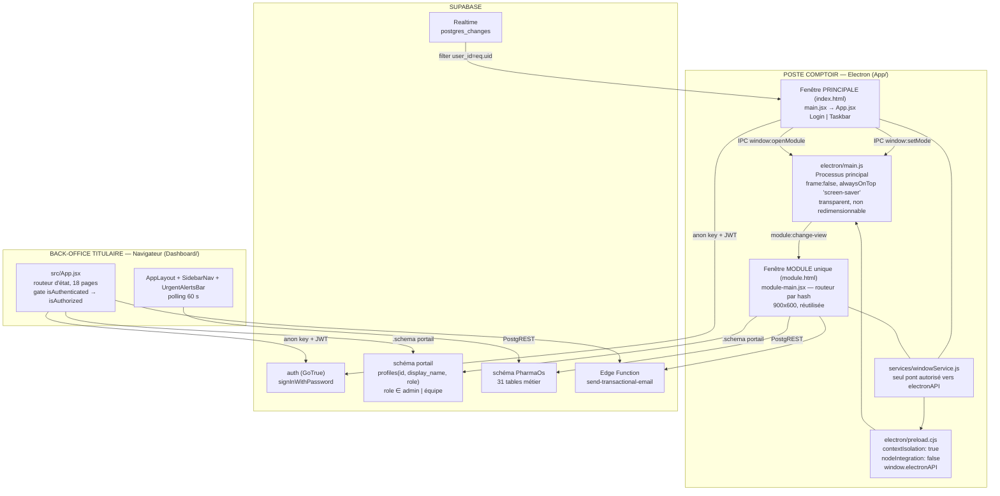
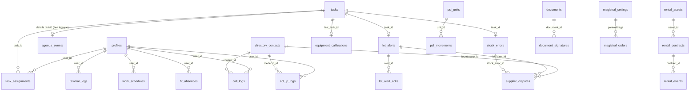

# PharmaOS — Documentation technique & audit métier officine

> Document de référence unique : architecture réelle, cartographie exhaustive des modules,
> audit métier officine de ville (France) et matrice de priorisation.
>
> **Base d'analyse** : lecture intégrale du code source du dépôt `PharmaOs/`
> (hors `App/dist/`, `Dashboard/dist/` et bundles minifiés).
> Toute affirmation est ancrée dans un fichier, une table ou une valeur littérale du code.
> Les manques sont signalés explicitement par **« non implémenté / non trouvé dans le code »**.

**Périmètre lu** : 95 fichiers source (`App/electron/*`, `App/src/**`, `Dashboard/src/**`, `.cursor/docs/*`, `.cursor/rules/*`).

**Fichiers non lisibles dans le workspace** (probablement exclus par `.cursorignore`, à ne pas confondre avec « absents du projet ») :
- `App/src/core/**` et `Dashboard/src/core/**` — notamment `AuthContext.jsx`, importé par quasiment tous les composants. La logique exacte de `signIn`, `isAuthorized`, `ALLOWED_ROLES` **n'a pas pu être vérifiée dans le code**.
- `App/package.json`, `App/vite.config.js`, `Dashboard/package.json`, `Dashboard/vite.config.js`.
- Aucun fichier `.env`, aucun dossier `supabase/`, aucun `schema.sql`, aucune migration versionnée : **le schéma de base de données n'existe pas dans le dépôt**, il est déduit par rétro-ingénierie des appels PostgREST.

---

## Sommaire

1. [Vue d'ensemble de l'architecture](#1-vue-densemble-de-larchitecture)
2. [Cartographie détaillée des modules existants](#2-cartographie-détaillée-des-modules-existants)
3. [Audit & améliorations spécifiques au métier d'officine de ville](#3-audit--améliorations-spécifiques-au-métier-dofficine-de-ville-france)
4. [Matrice de priorisation & feuille de route](#4-matrice-de-priorisation--feuille-de-route)

---

# 1. Vue d'ensemble de l'architecture

## 1.1 Stack technique réelle

| Composant | Technologie constatée | Preuve dans le code |
|---|---|---|
| Client comptoir | **Electron** (ESM, `import { app, BrowserWindow, ipcMain, screen } from 'electron'`) | `App/electron/main.js` |
| UI comptoir | React 18 + JSX, Vite (dev sur `http://localhost:5173`) | `App/src/main.jsx`, `main.js` l.67 |
| Back-office | SPA React 18 + Vite, **sans React Router** (routeur par état) | `Dashboard/src/App.jsx` |
| Styling | Tailwind CSS, icônes `lucide-react` | tous les `.jsx` |
| Graphiques | `recharts` (`LineChart`) | `Dashboard/src/components/TaskbarUsageCard.jsx` |
| Calendrier | `react-big-calendar` | `Dashboard/src/pages/AgendaManager.jsx` |
| Backend | **Supabase** (PostgREST + GoTrue), `@supabase/supabase-js` v2 | `*/src/services/supabaseClient.js` |
| E-mail transactionnel | **1 seule Edge Function** : `send-transactional-email` | `magistralService.js` (App + Dashboard), `Dashboard/src/services/cashService.js` |

**Chiffres clés du backend, mesurés sur le code :**

| Élément | Nombre | Détail |
|---|---|---|
| Schémas Supabase utilisés | **2** | `PharmaOs` (métier, schéma par défaut du client), `portail` (identités/rôles) |
| Tables distinctes référencées | **31** | voir §1.4 |
| Fonctions RPC Postgres appelées | **0** | aucun `.rpc()` dans tout le dépôt |
| Buckets Supabase Storage | **0** | aucun `supabase.storage.from()` — **aucun stockage de fichier n'est implémenté** |
| Canaux Realtime | **1** | `task_assignments_changes` dans `App/src/modules/Taskbar/Taskbar.jsx` |
| Edge Functions | **1** | `send-transactional-email` |
| Migrations / `schema.sql` versionnés | **0** | non trouvé dans le code |

> **Point d'attention majeur** : `supabase.storage` n'étant jamais appelé, **aucune ordonnance, aucun scan, aucun PDF, aucune photo n'est réellement stocké**. Les champs `prescription_scanned` (`rental_contracts`), `ordonnance_path` (`magistral_orders`) et `pieces` (`supplier_disputes`) sont respectivement un booléen, un chemin textuel jamais alimenté par un upload, et un champ libre. C'est un écart structurel majeur pour un usage officinal réel (voir §3.14).

## 1.2 Architecture générale et flux de données



**Il n'y a aucune communication directe entre l'App et le Dashboard.** Les deux clients sont strictement découplés et ne se parlent qu'**à travers la base Supabase**. Il n'existe **ni serveur applicatif intermédiaire, ni API métier propre** : chaque client parle directement à PostgREST avec la clé `anon` et le JWT de l'utilisateur. Toute la sécurité repose donc **entièrement sur les politiques RLS côté Supabase**, qui ne sont pas versionnées dans le dépôt.

## 1.3 Flux Electron détaillé (`App/electron/main.js`)

```
┌─────────────────────────────────────────────────────────────┐
│ Processus PRINCIPAL (Node) — main.js                        │
│                                                             │
│  createWindow()                                             │
│    BrowserWindow  frame:false  alwaysOnTop:true             │
│                   transparent:true  resizable:false         │
│                   movable:false  hasShadow:false            │
│    setAlwaysOnTop(true, 'screen-saver')                     │
│    setVisibleOnAllWorkspaces(true, {visibleOnFullScreen})   │
│    screen.on('display-metrics-changed') → recalcul bounds   │
│                                                             │
│  ipcMain.handle('window:setMode', mode)                     │
│    allowlist ['login','expanded','reduced'] sinon           │
│    { ok:false, error:'invalid-mode' }                       │
│      login    → 420 × 480, centré                           │
│      reduced  →  56 ×  28, centré en x, y = 0               │
│      expanded → largeur écran × 60, x = 0, y = 0            │
│                                                             │
│  ipcMain.handle('window:setIgnoreMouseEvents', ignore)      │
│    si mode 'reduced' → force ignore = false                 │
│    sinon setIgnoreMouseEvents(true, { forward:true })       │
│                                                             │
│  ipcMain.handle('window:openModule', view, data)            │
│    UNE SEULE moduleWindow (900 × 600, autoHideMenuBar)      │
│    si existe → restore + focus + send 'module:change-view'  │
│    sinon     → create + load module.html#<view>             │
└─────────────────────────────────────────────────────────────┘
                          ▲   contextBridge
                          │   window.electronAPI = {
                          │     setWindowMode, setIgnoreMouseEvents,
                          │     openModule, onModuleChangeView }
┌─────────────────────────┴───────────────────────────────────┐
│ Processus de RENDU (Chromium, sandboxé)                     │
│   App/src/services/windowService.js                         │
│     setWindowMode / loginWindow / expandWindow /            │
│     reduceWindow / openModuleWindow / setClickThrough       │
│   Dégrade proprement hors Electron (console.warn + null)    │
└─────────────────────────────────────────────────────────────┘
```

**Ergonomie qui en découle** : la barre PharmaOS est une **surcouche permanente en haut de l'écran du poste comptoir**, posée *par-dessus* le LGO du marché. Elle n'occupe que 60 px déployée, 28 px repliée, et laisse passer les clics (`setIgnoreMouseEvents` avec `forward: true`) pour ne pas gêner l'utilisation du LGO sous-jacent. C'est un choix d'architecture décisif pour l'analyse de positionnement du §3.20.

**Vues de la fenêtre module** (`App/src/module-main.jsx`, switch sur le hash) — 17 vues + un placeholder :

`directory` (défaut) · `call` · `ip` · `tasks` · `order` · `billing` · `quality` · `controls` · `documents` · `perimes` · `stock` · `rental` · `disputes` · `lot_alerts` · `magistral` · `psl` · `cash` · *(défaut → `PlaceholderModule` « Module Introuvable »)*.

## 1.4 Modèle de données Supabase (rétro-ingénierie)



### Inventaire complet des 31 tables

| Schéma | Table | Rôle métier | Valeurs d'énumération observées dans le code |
|---|---|---|---|
| `portail` | `profiles` | Identités & habilitations | `role` : `admin`, `équipe` |
| `PharmaOs` | `tasks` | Tâches d'équipe | `description` = **texte OU JSON** ; `type` JSON : `stock_error`, `stock_recompte`, `perimes_mensuel`, `retrait_lot`, `etalonnage_rdv` |
| `PharmaOs` | `task_assignments` | Affectation nominative | `statut` : `en_cours`, `terminee` |
| `PharmaOs` | `agenda_events` | Agenda officine | `type` : `commande_med`, `facturation`, `changement_horaire` |
| `PharmaOs` | `taskbar_logs` | Télémétrie / pointage de fait | `action` : `login`, `expand`, `collapse` |
| `PharmaOs` | `call_logs` | Registre des appels | `type` : `in`, `out`, `missed` ; `statut_traitement` : `cloture`, `a_rappeler`, `transmis_pharmacien`, `en_attente` ; `motif` : `information_medicale`, `commande_labo`, `reclamation_patient`, `renseignement_patient`, `autre` |
| `PharmaOs` | `directory_contacts` | Annuaire pro & fournisseurs | `type` : `health_professional`, `commercial_partner` |
| `PharmaOs` | `act_ip_logs` | Interventions pharmaceutiques (SFPC / Act-IP) | `statut_ip` : `Cloturee`, `En attente`, `Déclaré` ; `patient_sexe` : `M`, `F` ; `avis_prescripteur` : `Accepte`, `Refuse`, `Non joignable`, `Non contacté` / `Non contacte` |
| `PharmaOs` | `stock_errors` | Écarts de stock | `status` : `ouvert`, `recompter`, `erreur_commande`, `cloture` ; `admin_decision` : `recompter`, `erreur_commande` |
| `PharmaOs` | `perimes` | Suivi des périmés | `status` : `actif`, `mis_en_avant`, `promo`, `retire` ; `source` : `reception`, `inventaire` |
| `PharmaOs` | `lot_alerts` | Retraits / rappels de lots | `status` : `ouvert`, `en_cours`, `clos` ; `source` : `manuel` |
| `PharmaOs` | `lot_alert_acks` | Accusés de lecture nominatifs | — (`alert_id`, `user_id`, `read_at`, upsert `onConflict: 'alert_id,user_id'`) |
| `PharmaOs` | `psl_units` | Unités MDS (dérivés du sang) | `statut` : `en_stock`, `delivre` |
| `PharmaOs` | `psl_movements` | Registre MDS entrées/sorties | `movement_type` : `reception`, `delivrance` |
| `PharmaOs` | `magistral_settings` | Paramétrage préparations | — |
| `PharmaOs` | `magistral_orders` | Devis/commandes magistrales | `statut` : `devis`, `commande`, `receptionne`, `cloture` |
| `PharmaOs` | `cash_closures` | Clôtures de caisse | — |
| `PharmaOs` | `daily_controls` | Contrôles quotidiens | `control_type` : `temperature_frigo`, `temperature_frigo_a`, `temperature_frigo_b`, `controle_stupefiants`, `menage_officine` ; `shift` : `matin`, `soir` |
| `PharmaOs` | `equipment_calibrations` | Étalonnage (balance) | — |
| `PharmaOs` | `quality_events` | Non-conformités & CAPA | `type` : `erreur_delivrance`, `presqu_erreur`, `reclamation_patient`, `probleme_fournisseur` ; `severity` : `mineure`, `majeure`, `critique` ; `status` : `ouvert`, `en_analyse`, `cloture` ; `capa_status` : `en_attente`, `en_cours`, `termine` |
| `PharmaOs` | `documents` | GED procédures | `category` : `procedure`, `instruction`, `formulaire` ; `is_active` |
| `PharmaOs` | `document_signatures` | Émargement des procédures | — |
| `PharmaOs` | `supplier_disputes` | Litiges fournisseurs | `dispute_type` : `commande`, `facturation`, `perimes`, `challenge`, `retrait_lot`, `autre` ; `statut` : `ouvert`, `en_cours`, `clos` |
| `PharmaOs` | `rental_assets` | Parc de matériel | `status` : `disponible`, `loue`, `maintenance`, `retire` ; `asset_type` : `lit`, `tens`, `aerosol`, `balance_bebe`, `tensiometre`, `fauteuil_roulant`, `autre` |
| `PharmaOs` | `rental_contracts` | Contrats de location | `statut` : `demande`, `attente_reception`, `en_cours`, `retourne` ; `source_type` : `stock_pharma`, `stock_presta`, `commande` ; `billing_status` : `en_attente`, `facture`, `partiel` |
| `PharmaOs` | `rental_events` | Journal de location | `event_type` : `note`, `sortie`, `retour` |
| `PharmaOs` | `work_schedules` | Planning théorique | `actif` (bool), `day_of_week` |
| `PharmaOs` | `hr_absences` | Absences | `absence_type` : `conge`, `absence`, `maladie`, `rtt`, `formation`, `autre` |
| `PharmaOs` | `hr_schedule_changes` | Modifications d'horaires | `motif` : `Retard / arrivée`, `Départ anticipé`, `Congés`, `Absence` |
| `PharmaOs` | `app_settings` | Réglages clé/valeur | `key` : `cash_accountant_email` |
| `PharmaOs` | `advice_events` | Conseils associés — **non branché** | `status` en paramètre libre ; UI = **mock** |

## 1.5 Authentification, rôles et sécurité

- **Authentification** : `supabase.auth.signInWithPassword` (email / mot de passe), encapsulé dans `AuthContext` — **fichier non lisible dans le workspace**, la logique exacte n'a pas pu être vérifiée.
- **Autorisation applicative Dashboard** : `App.jsx` applique une porte unique `isLoading → null`, `!isAuthenticated → Login`, `!isAuthorized → AccessDenied`, sinon `AppLayout`. `AccessDenied.jsx` indique explicitement que le rôle requis est **Admin** (`portail.profiles.role`).
- **Aucun contrôle d'accès par page** : `navConfig.js` ne porte **aucune restriction de rôle** sur ses 18 entrées, et `SidebarNav.jsx` ne filtre rien. Un `admin` voit tout, un non-admin ne voit rien. Il n'existe **aucune granularité intermédiaire** (voir §3.15).
- **Aucun contrôle de rôle côté App** : aucun module de `App/src/modules/` ne teste le rôle de l'utilisateur courant. Les seuls usages du rôle sont des **filtres de destinataires** : `.eq('role', 'admin')` dans `stockService.js` (App) et `.in('role', ['admin', 'équipe'])` dans `QuickAction.jsx`, `hrService.js`, `agendaTaskService.js`, `ipService.js`.
- **Durcissement Electron correct** : `contextIsolation: true` et `nodeIntegration: false` sur **les deux** `BrowserWindow` ; canaux IPC allowlistés ; aucune API Node (`fs`, `shell`, `child_process`) exposée.
- **Clés** : `App/src/services/supabaseClient.js` lit uniquement `VITE_SUPABASE_URL` / `VITE_SUPABASE_ANON_KEY` et journalise une erreur si absentes. **Le fallback de clés en dur décrit dans `.cursor/docs/SECURITY.md` et `ARCHITECTURE.md` n'existe plus dans le code lu** : la documentation interne est sur ce point périmée.
- **RLS** : non versionnée dans le dépôt (`non trouvé dans le code`). `SECURITY.md` documente le modèle attendu (isolation par `user_id = auth.uid()`, bypass admin via `EXISTS ... profiles.role = 'admin'`). Plusieurs écritures Dashboard sont structurellement en tension avec une RLS stricte, notamment `completeTaskGlobal` / `uncompleteTaskGlobal` qui font un `UPDATE` sur **toutes** les lignes `task_assignments` d'un `task_id`.

## 1.6 Rôles respectifs des deux interfaces

| | **App Electron — poste comptoir** | **Dashboard web — back-office** |
|---|---|---|
| Utilisateurs | Toute l'équipe : pharmacien adjoint, préparateur, apprenti, étudiant | Titulaire / adjoint référent (`role = 'admin'` exclusivement) |
| Forme | Barre always-on-top 60 px + une fenêtre module 900×600 | SPA plein écran, sidebar 4 sections |
| Posture | **Saisie à chaud**, en 20 secondes, sans quitter le LGO | **Pilotage à froid** : traitement, arbitrage, statistiques, export |
| Portée des données | Principalement **les siennes** (`.eq('user_id', userId)`, `.eq('created_by', userId)`, `limit 10–20`) | **Toute l'officine**, sans filtre utilisateur |
| Verbes dominants | `INSERT` | `SELECT`, `UPDATE`, `DELETE` |
| Exemple typique | Le préparateur trace un appel labo entre deux patients | Le titulaire arbitre un écart de stock : *recompter* ou *erreur de commande* |

Ce couple **saisie terrain / traitement titulaire** est le pattern central et cohérent de l'application : dans 9 modules sur 21, l'App crée l'enregistrement et le Dashboard le fait avancer dans son cycle de vie.

---

# 2. Cartographie détaillée des modules existants

**21 modules implémentés + 1 module mocké (Advice) = 22 modules cartographiés.**

---

## 2.1 Authentification & habilitations

**Fichiers clés**
- App : `App/src/App.jsx`, `App/src/modules/Auth/Login.jsx`, `App/src/core/AuthContext.jsx` *(non lisible)*
- Dashboard : `Dashboard/src/App.jsx`, `Dashboard/src/pages/Login.jsx`, `Dashboard/src/pages/AccessDenied.jsx`, `Dashboard/src/core/AuthContext.jsx` *(non lisible)*
- Tables : `auth.users` (Supabase), `portail.profiles` (`id`, `display_name`, `role`)

**Fonctionnalités actuelles**
- Connexion email + mot de passe, deux champs, un bouton, un message d'erreur. Pas de MFA, pas de reset de mot de passe, pas de SSO — **non implémenté**.
- Côté App : `App.jsx` bascule la fenêtre via `loginWindow()` / `expandWindow()` selon `isAuthenticated`. Aucun contrôle de rôle.
- Côté Dashboard : porte unique `isAuthorized` (rôle `admin`).
- Les initiales affichées dans la Taskbar proviennent de `profile.display_name`.

**Fonctionnement dans le réel**
Chaque membre de l'équipe ouvre sa session sur le poste comptoir en début de vacation ; la barre passe en mode `expanded` et le premier `taskbar_logs.action = 'login'` sert de facto de pointage d'arrivée (exploité par le module RH). Le titulaire, lui, ouvre le Dashboard depuis son bureau ou son domicile.

**Écarts constatés** : aucune notion de **carte CPS / e-CPS**, aucune traçabilité du **RPPS/ADELI** du pharmacien, aucune distinction d'habilitation entre pharmacien et préparateur (voir §3.15). Le rôle n'est **pas dans le JWT** : un changement de rôle n'est effectif qu'après rechargement de session.

---

## 2.2 Taskbar — barre comptoir

**Fichiers clés**
- App : `App/src/modules/Taskbar/Taskbar.jsx`
- Services : `App/src/services/windowService.js`, `App/src/services/dbServices.js` (`logTaskbarToggle`)
- Dashboard : `Dashboard/src/components/TaskbarUsageCard.jsx`, `Dashboard/src/services/statsService.js` (`fetchTaskbarUsageStats`)
- Tables : `PharmaOs.taskbar_logs`, `PharmaOs.task_assignments` (lecture badge)

**Fonctionnalités actuelles**
- Trois sections de lanceurs, 17 boutons au total :

| Section | Libellés (attribut `title` réel) |
|---|---|
| **Principal** | Mes tâches du jour · Commander un médicament · Facturation à effectuer · Tracer un appel téléphonique · Annuaire des contacts · Interventions pharmaceutiques (Act-IP) |
| **Qualité** | Non-conformités qualité · Contrôles qualité · Procédures / documents · Gestion des périmés · Déclarer une erreur de stock · Alertes retrait de lot |
| **Métier** | Location de matériel · Préparations magistrales · Registre MDS (dérivés du sang) · Clôture de caisse · Litiges fournisseurs |

- Badge de tâches en attente : `.from('task_assignments').select('id, tasks(description)').eq('user_id', user.id).eq('statut', 'en_cours')` — **requête `.from()` directe dans le composant**, en violation de la règle « services isolés » de `convention.mdc`.
- **Seul abonnement Realtime du projet** : canal `task_assignments_changes`, `postgres_changes` `*` sur `PharmaOs.task_assignments`, `filter: user_id=eq.<uid>`.
- Bandeau texte statique : « Conseil : proposez un produit associé. » — chaîne codée en dur, **aucune logique de conseil associé implémentée**.
- Journalisation `login` / `expand` / `collapse` dans `taskbar_logs`.

**Fonctionnement dans le réel**
C'est le point d'entrée unique de l'équipe. Le comptoir travaille dans le LGO (LGPI, Winpharma…) ; PharmaOS reste une bande de 60 px en haut de l'écran. Dès qu'un événement survient — un labo qui appelle, un écart de stock constaté au picking, un patient qui réclame — l'opérateur clique sur l'icône correspondante sans fermer sa vente en cours. La fenêtre module s'ouvre en 900×600, la saisie prend quelques secondes, on referme. Le badge rouge sur « Mes tâches » signale en temps réel qu'une tâche vient d'être assignée par le titulaire.

---

## 2.3 Tâches d'équipe

**Fichiers clés**
- App : `App/src/modules/Tasks/Tasks.jsx` (vue `#tasks`)
- Dashboard : `Dashboard/src/pages/TasksManager.jsx`, `Dashboard/src/components/TaskStatsCard.jsx`
- Services : `Dashboard/src/services/agendaTaskService.js` (App : `.from()` direct dans le composant)
- Tables : `PharmaOs.tasks`, `PharmaOs.task_assignments`, `portail.profiles`

**Fonctionnalités actuelles**
- **App** : liste « Mes Tâches en cours » filtrée `user_id` + `statut = 'en_cours'`. Le champ `tasks.description` est **parsé en JSON** et rendu différemment selon `type` : `retrait_lot`, `stock_error`, `stock_recompte`, `perimes_mensuel`, `etalonnage_rdv`, plus les formats commande/facturation. Clôture individuelle avec note (« Ajouter une note ou visa de clôture… »). Cas particulier `retrait_lot` : une modale demande la « Quantité isolée » et **réécrit `tasks.description`** pour y injecter `quantite_isolee`.
- **Dashboard** : création de tâche (`titre`, `description`, cases d'assignation), filtres `en_cours` / `terminee` / `all` et par utilisateur, édition en ligne, **validation globale** (`completeTaskGlobal` → `UPDATE` sur toutes les assignations d'un `task_id`) et annulation de validation.
- Mesure du temps : `completion_time_seconds` sur `task_assignments`.

**Fonctionnement dans le réel**
C'est le canal d'instruction du titulaire vers l'équipe et le réceptacle de toutes les tâches générées automatiquement par les autres modules (recomptage, retrait de lot, inventaire mensuel des périmés, RDV d'étalonnage). En pratique le préparateur ouvre « Mes tâches du jour » en début de vacation, traite ce qui le concerne et vise chaque ligne. La validation globale du titulaire correspond à la clôture d'une action collective : *« le rappel de lot a été traité, tout le monde est couvert »*.

**Écart technique notable** : `tasks.description` sert simultanément de texte libre et de conteneur JSON métier polymorphe (au moins 5 types). Chaque module lit et réécrit ce champ. C'est une **dette structurelle** : pas de contrainte, pas de validation, pas d'index exploitable (voir §3.17).

---

## 2.4 QuickAction — commande médicament & facturation

**Fichiers clés**
- App : `App/src/modules/Tasks/QuickAction.jsx` (vues `#order` et `#billing`)
- Tables : `portail.profiles`, `PharmaOs.tasks`, `PharmaOs.task_assignments`, `PharmaOs.agenda_events`

**Fonctionnalités actuelles**
- Formulaire unique piloté par la prop `type` (`'order'` | `'billing'`) : `nom`, `prenom`, `dob`, `medicament_ou_facture`, `cip`, `recurrence_semaines`, `repetitions`, `date`, `commentaire`.
- Écrit **quatre tables en cascade** : sélection des profils `role IN ('admin','équipe')` → `INSERT tasks` (description JSON) → `INSERT task_assignments` pour chacun (`statut: 'en_cours'`) → `INSERT agenda_events` (`type` : `commande_med` ou `facturation`).
- La récurrence génère une **série** d'événements (`seriesIndex`, `totalSeries`, `groupId` dans `details`).
- **Requêtes `.from()` directes dans le composant** (violation de `convention.mdc`).

**Fonctionnement dans le réel**
Le patient sous traitement chronique demande qu'on lui commande sa boîte tous les 28 jours ; ou une ordonnance doit être facturée plus tard (pièces manquantes, mutuelle à vérifier, ordonnance en attente de renouvellement). L'opérateur saisit nom/prénom/date de naissance, le médicament, le rythme, et le système génère la série de rappels dans l'agenda **et** la tâche pour toute l'équipe. C'est le classique « cahier de commandes patients » et le « bac à facturer », informatisés.

**Écart réglementaire** : l'identification patient repose sur `nom` + `prenom` + `dob` en clair dans un champ JSON, sans rattachement à un identifiant patient du LGO, sans INS. C'est une **donnée de santé nominative** stockée hors du LGO (voir §3.16 et §3.19).

---

## 2.5 Agenda

**Fichiers clés**
- Dashboard : `Dashboard/src/pages/AgendaManager.jsx` (`react-big-calendar`)
- Service : `Dashboard/src/services/agendaTaskService.js`
- Tables : `PharmaOs.agenda_events`, `PharmaOs.tasks`, `PharmaOs.task_assignments`

**Fonctionnalités actuelles**
- Vue calendrier, création manuelle « Commander Médicament » et « Facturation », modale de détail (modifier / supprimer seul / supprimer la série via `details.groupId`), option `updateFuture`.
- Le type `changement_horaire` est **filtré et exclu** de l'affichage calendrier et **n'est créable depuis aucune UI** — écrit uniquement par `agendaTaskService.createAgendaEvent`.
- Suppression en cascade : suppression d'un `agenda_events` supprime les `tasks` liées via `details.taskId` (lien **logique**, pas de clé étrangère observable).
- Aucun export iCal / ICS — **non implémenté**.

**Fonctionnement dans le réel**
Le titulaire visualise sur un mois les commandes patients à passer et les facturations à traiter. Il déplace, annule ou prolonge une série quand le traitement du patient change. **Il n'y a en revanche aucune gestion des gardes, des astreintes, ni des horaires d'ouverture** dans ce calendrier (voir §3.18).

---

## 2.6 Erreurs de stock

**Fichiers clés**
- App : `App/src/modules/Stock/StockError.jsx` (vue `#stock`)
- Dashboard : `Dashboard/src/pages/StockErrorManager.jsx`
- Services : `App/src/services/stockService.js` (`declareStockError`, `fetchMyStockErrors`), `Dashboard/src/services/stockService.js` (`fetchStockErrors`, `resolveStockError`)
- Tables : `PharmaOs.stock_errors`, `PharmaOs.tasks`, `PharmaOs.task_assignments`, `portail.profiles`

**Fonctionnalités actuelles**
- **App** : formulaire `medicament`, `cip`, `quantite_theorique`, `quantite_constatee`, `description`. À l'envoi, `declareStockError` récupère les profils `role = 'admin'`, crée une `tasks` (JSON `type: 'stock_error'`, `urgent: true`), l'assigne aux admins, puis insère la ligne `stock_errors` (`status: 'ouvert'`, `task_id`). Historique des 15 dernières déclarations personnelles.
- **Dashboard** : file « À traiter » (`status = 'ouvert'`), note admin, **deux décisions** : `recompter` (crée une nouvelle tâche `stock_recompte` pour l'équipe) ou `erreur_commande` (clôt et termine l'assignation). Historique en table.

**Fonctionnement dans le réel**
Au picking, le préparateur constate que le rayon annonce 4 boîtes et qu'il n'y en a que 2. Plutôt que de laisser dériver le stock théorique du LGO, il déclare l'écart en 15 secondes. Le titulaire arbitre : soit on fait recompter physiquement le linéaire (l'écart vient d'une erreur de dispensation ou d'une démarque), soit c'est une erreur de commande/livraison grossiste et cela bascule potentiellement en litige fournisseur.

**Écart** : la correction n'est **jamais réinjectée dans le LGO** — le stock théorique reste faux tant qu'un humain ne le corrige pas manuellement dans LGPI/Winpharma (voir §3.11).

---

## 2.7 Périmés

**Fichiers clés**
- App : `App/src/modules/Perimes/Perimes.jsx` (vue `#perimes`)
- Dashboard : `Dashboard/src/pages/PerimesManager.jsx`
- Services : `App/src/services/perimesService.js`, `Dashboard/src/services/perimesService.js`
- Table : `PharmaOs.perimes`

**Fonctionnalités actuelles**
- **App**, onglet « Saisie » : `source` (`reception` | `inventaire`), `medicament`, `cip`, `lot`, `date_peremption`, `quantite`, `notes` → `status: 'actif'`. Onglet « À 3 mois » : `fetchPerimesExpiringSoon()` filtre `status = 'actif'` et `date_peremption` entre aujourd'hui et +3 mois. Trois actions de traitement : **En avant** (`mis_en_avant`), **Promo** (`promo`), **Retiré** (`retire`).
- **Dashboard** : filtres `soon` / `all` / `mis_en_avant` / `promo` / `retire`, table complète, et bouton « Tâche mensuelle équipe » (`createMonthlyPerimesTask`, JSON `type: 'perimes_mensuel'`).

**Fonctionnement dans le réel**
Deux points de saisie conformes à la pratique : à la **réception** de la commande grossiste (contrôle des DLU courtes livrées) et lors de l'**inventaire tournant** mensuel du rayon. Les produits à moins de 3 mois sont ensuite « travaillés » : mis en avant au comptoir, passés en promotion, ou retirés du linéaire pour destruction ou retour grossiste.

**Écarts** : aucune gestion des **retours grossiste** (bon de retour, avoir attendu, rapprochement de l'avoir), aucun lien avec le circuit **Cyclamed / DASRI**, et le statut `retire` ne dit pas ce qu'est devenu le produit (voir §3.12).

---

## 2.8 Retraits & rappels de lots

**Fichiers clés**
- App : `App/src/modules/LotAlerts/LotAlerts.jsx` (vue `#lot_alerts`)
- Dashboard : `Dashboard/src/pages/RetraitLotManager.jsx`
- Services : `App/src/services/lotAlertService.js`, `Dashboard/src/services/lotAlertService.js`, `Dashboard/src/services/disputeService.js` (`createDisputeFromLotAlert`)
- Tables : `PharmaOs.lot_alerts`, `PharmaOs.lot_alert_acks`, `PharmaOs.tasks`, `PharmaOs.task_assignments`, `PharmaOs.supplier_disputes`

**Fonctionnalités actuelles**
- **Dashboard (déclaration)** : `alert_number`, `laboratoire`, `medicament`, `lot`, `motif`, `requires_return`, `return_location`, `source` (défaut `'manuel'`), `external_ref`. `createLotAlert` crée en cascade une `tasks` (`type: 'retrait_lot'`) assignée à toute l'équipe, la ligne `lot_alerts` (`status: 'ouvert'`), et **automatiquement un litige fournisseur** si `requires_return`.
- **App** : deux sections « À lire » / « Déjà lues » (`fetchOpenLotAlerts` = `.neq('status', 'clos')`), affichage `medicament` / `lot` / `alert_number` / `laboratoire` / `motif`, bouton « Lu » → **upsert nominatif** dans `lot_alert_acks` (`onConflict: 'alert_id,user_id'`).
- **Dashboard (suivi)** : consultation des accusés de lecture par personne, modale « Démarches » (`steps_done`, `reception_validated_at`, passage en `en_cours`), clôture (`clos`).
- La tâche `retrait_lot` demande à chaque opérateur la **quantité isolée** (modale dans `Tasks.jsx`).

**Fonctionnement dans le réel**
C'est **le module le plus abouti et le plus proche d'une vraie exigence réglementaire du dépôt.** Un DGS-Urgent ou un retrait ANSM tombe par mail ou via le grossiste. Le titulaire saisit l'alerte ; toute l'équipe reçoit la tâche et la voit dans « À lire ». Chacun accuse réception nominativement — c'est exactement la preuve d'information de l'équipe qu'un inspecteur de l'ARS demandera. Les opérateurs isolent physiquement les boîtes concernées et déclarent la quantité isolée. Le titulaire trace les démarches (retour labo, destruction, rappel patients) puis clôt.

**Écarts** : `source: 'manuel'` uniquement — **aucune intégration DGS-Urgent, ANSM ou messagerie du grossiste**. Aucun rappel des patients ayant reçu le lot (l'App n'a pas accès à l'historique de dispensation). Voir §3.9.

---

## 2.9 MDS / PSL — Médicaments dérivés du sang

**Fichiers clés**
- App : `App/src/modules/Psl/Psl.jsx` (vue `#psl`)
- Dashboard : `Dashboard/src/pages/PslManager.jsx`
- Services : `App/src/services/pslService.js` (`parseDatamatrix`, `receivePslUnit`, `deliverPslUnit`, `fetchStockUnits`, `fetchDeliveryHistory`), `Dashboard/src/services/pslService.js` (`fetchPslUnits`, `fetchPslMovements`, `fetchMdsDeliveries`, `printMdsRegistry`, `exportPslRegisterCsv`)
- Tables : `PharmaOs.psl_units`, `PharmaOs.psl_movements`

**Fonctionnalités actuelles**
- **Lecture Datamatrix** : `parseDatamatrix(raw)` côté App, saisie par champ texte + touche Entrée (scan clavier). Extraction vers `gtin`, `lot`, `date_peremption`, `numero_unite`, `datamatrix_raw` conservé brut.
- **Onglet Réception** : `denomination`, `code_produit`, `numero_unite`, `lot`, `date_peremption`, `fournisseur` → `psl_units` (`statut: 'en_stock'`) + `psl_movements` (`movement_type: 'reception'`).
- **Onglet Délivrance** : sélection de l'unité, prescripteur (`prescripteur_nom`, `prescripteur_adresse`), patient (`patient_nom`, `patient_prenom`, `patient_adresse`, `patient_dob`, `patient_initiales`, `patient_ipp`), `quantite`, `etiquette_tracabilite`, `notes`. `deliverPslUnit` passe l'unité à `delivre` **avec garde de concurrence** (`.eq('statut','en_stock')`) et **rollback** si l'insertion du mouvement échoue — c'est le seul endroit du dépôt où une transaction est simulée proprement.
- **Dashboard** : registre consultable, **export CSV** (`exportPslRegisterCsv`) et **impression HTML** du registre (`printMdsRegistry`), ordonné par `registry_number`.

**Fonctionnement dans le réel**
Les MDS (albumine, immunoglobulines, facteurs de coagulation) imposent une traçabilité **sans faille** : le pharmacien doit pouvoir remonter, pour chaque unité délivrée, du numéro d'unité au patient et au prescripteur, et conserver ce registre 40 ans. En pratique on scanne le Datamatrix à la réception, on scanne à la délivrance, on colle l'étiquette de traçabilité sur l'ordonnance. Le module reproduit fidèlement ce circuit, et l'export imprimable du registre est un vrai livrable d'inspection.

**Écarts** : `registry_number` est lu à l'affichage mais **sa génération n'est trouvée nulle part dans le code** (probablement une valeur par défaut Postgres non versionnée — à confirmer côté base). Pas d'archivage légal à 40 ans, pas d'horodatage qualifié, pas de scellement anti-modification (voir §3.7).

---

## 2.10 Préparations magistrales

**Fichiers clés**
- App : `App/src/modules/Magistral/Magistral.jsx` (vue `#magistral`)
- Dashboard : `Dashboard/src/pages/MagistralManager.jsx`
- Services : `App/src/services/magistralService.js`, `Dashboard/src/services/magistralService.js`
- Tables : `PharmaOs.magistral_settings`, `PharmaOs.magistral_orders` ; Edge Function `send-transactional-email`

**Fonctionnalités actuelles**
- **Formulaire App** structuré en fieldsets qui reproduit un bon de commande de sous-traitance :
  - *Pharmacie* : `pharmacy_name`, `pharmacy_address`, `pharmacy_email`, `pharmacy_interlocuteur` (préremplis depuis `magistral_settings`)
  - *Demande* : nature (`devis` | `commande`), historique (`premiere` | `renouvellement`), prescripteur, voie d'administration, **formule**
  - *Patient* : nom/prénom **réduits à 2 lettres** (`maskPatient`), `dob`, type (`ad` adulte | `ped` pédiatrique | `vet` vétérinaire), allergies, déglutition, grossesse/allaitement
  - *Analyse pharmaceutique* : `dose_posologie_ok` (case à cocher), contre-indications, interactions, justifications, commentaires
  - Case `preparation_interne`
- **Tarification** : `calcMagistralPrice(settings, prixHtNet, tvaRate)` avec `coefficient` et `frais_port` paramétrables ; TVA par défaut `5.5`.
- **Cycle de vie** : `devis` → `commande` → `receptionne` → `cloture`, avec `closed_reason` (ex. `'Devis refusé'`).
- **Dashboard** : onglets `orders` / `parametres`, édition du `form_data` JSON, `validateDevis`, `receiveOrder`, `closeOrder`, `saveOrderEdit`, envoi e-mail prestataire et notification patient via l'Edge Function.

**Fonctionnement dans le réel**
Très fidèle à la pratique majoritaire : la plupart des officines **sous-traitent** leurs magistrales à un façonnier. Le circuit est bien celui du terrain — demande de devis avec la formule et le contexte patient, validation du devis, commande, réception avec saisie du prix HT net, application du coefficient officinal, et notification du patient que sa préparation est disponible. Le pseudonymat du patient (2 lettres) avant envoi externe est une **bonne pratique RGPD réellement implémentée**.

**Écarts** : la case `preparation_interne` existe mais **aucun circuit de préparation interne n'est implémenté** — pas de fiche de fabrication, pas de numéro de lot de préparation, pas de pesées, pas de matières premières, pas d'étiquetage, pas de registre des préparations. C'est l'écart le plus net vis-à-vis des **BPP** (voir §3.10). Aucun upload de l'ordonnance (`ordonnance_path` jamais alimenté).

---

## 2.11 Clôture de caisse

**Fichiers clés**
- App : `App/src/modules/Cash/CashClosure.jsx` (vue `#cash`)
- Dashboard : `Dashboard/src/pages/CashManager.jsx`
- Services : `App/src/services/cashService.js` (`submitCashClosure`, `fetchMyClosures`, `calcEcart`), `Dashboard/src/services/cashService.js` (`fetchCashClosures`, `exportMonthlyCsv`, `exportMonthlyPdf`, `getAccountantEmail`, `setAccountantEmail`, `emailMonthlyReport`)
- Tables : `PharmaOs.cash_closures`, `PharmaOs.app_settings` (clé `cash_accountant_email`)

**Fonctionnalités actuelles**
- **App** : `closure_date`, `fond_reel`, `fond_logiciel`, `montant_cb`, `argent_lieu_sur`, `nb_cheques`, `montant_cheques`, cases `garde` et `sortie_particuliere` (avec `sortie_montant` et `sortie_motif` conditionnels), `notes`. L'écart est calculé et affiché en direct (`calcEcart`).
- **Dashboard** : sélection par mois (`<input type="month">`), table récapitulative avec écart, **export CSV** et **export PDF via impression HTML**.
- **Envoi automatique au comptable : présent dans le service mais non branché à l'UI** — la page affiche littéralement « L'envoi automatique au comptable sera branché plus tard ».

**Fonctionnement dans le réel**
Rituel de fin de journée : on compte la caisse physique, on relève le total logiciel du LGO, on note les CB, les chèques, l'argent mis au coffre (« lieu sûr »), les sorties d'espèces exceptionnelles. L'écart signale une erreur de rendu de monnaie ou pire. La case `garde` distingue le chiffre d'affaires réalisé pendant la garde. En fin de mois, le titulaire exporte pour l'expert-comptable.

**Écart** : les montants sont saisis **manuellement** depuis le LGO. Aucune récupération automatique du Z de caisse.

---

## 2.12 Contrôles quotidiens & étalonnage

**Fichiers clés**
- App : `App/src/modules/Controls/Controls.jsx` (vue `#controls`)
- Dashboard : `Dashboard/src/pages/ControlsManager.jsx`
- Services : `App/src/services/controlsService.js` (`CONTROL_TYPES`, `SHIFTS`, `insertDailyControl`, `fetchTodayControls`, `fetchEquipmentCalibrations`), `Dashboard/src/services/controlsService.js` (`fetchEquipments`, `upsertEquipment`, `fetchDailyControls`, `fetchControlsStats`)
- Tables : `PharmaOs.daily_controls`, `PharmaOs.equipment_calibrations`, `PharmaOs.tasks`, `PharmaOs.task_assignments`

**Fonctionnalités actuelles**
- Trois types de contrôle côté App (`CONTROL_TYPES`) : `temperature_frigo`, `controle_stupefiants`, `menage_officine`. Deux vacations (`SHIFTS`) : `matin`, `soir`. Le Dashboard affiche en plus des libellés pour `temperature_frigo_a` et `temperature_frigo_b` (**divergence App/Dashboard** : ces deux types ne sont saisissables nulle part dans l'App).
- Saisie : `control_type`, `shift`, `value` (température), `is_compliant`, `details.notes`.
- **Étalonnage** : `equipment_calibrations` (`equipment_name` défaut `'Balance'`, `calibration_end_date`, `next_visit_date`) ; le Dashboard peut créer une tâche de RDV (`type: 'etalonnage_rdv'`) assignée aux `admin`.
- **Dashboard** : KPI (semaine, jour, non conformes, température frigo matin), filtre 7/30 jours, table datée et signée.

**Fonctionnement dans le réel**
Relevé bi-quotidien de la température du réfrigérateur (chaîne du froid : vaccins, insulines, dérivés du sang), comptage des stupéfiants, traçabilité du ménage. Ce sont des enregistrements attendus en inspection ARS et dans une démarche qualité type ISO 9001 / référentiel qualité de l'Ordre. L'étalonnage annuel de la balance est une obligation légale pour les préparations.

**Écarts sérieux** : aucune **borne d'alerte automatique** (le frigo doit rester entre +2 et +8 °C ; `is_compliant` est une case cochée à la main, pas un contrôle calculé), aucune **alerte en cas d'oubli de relevé**, aucune sonde connectée, aucune traçabilité des **excursions de température** ni de la conduite à tenir. Voir §3.13.

---

## 2.13 Qualité — non-conformités & CAPA

**Fichiers clés**
- App : `App/src/modules/Quality/Quality.jsx` (vue `#quality`)
- Dashboard : `Dashboard/src/pages/QualityManager.jsx`, `Dashboard/src/components/QualityStatsCard.jsx`
- Services : `App/src/services/qualityService.js`, `Dashboard/src/services/qualityService.js` ; `App/src/services/dbServices.js` contient un `insertQualityEvent` **marqué deprecated**
- Table : `PharmaOs.quality_events`

**Fonctionnalités actuelles**
- **App** : déclaration d'une non-conformité — `type` (`erreur_delivrance`, `presqu_erreur`, `reclamation_patient`, `probleme_fournisseur`), `severity` (`mineure`, `majeure`, `critique`), `description`, `immediate_action`, `location`, `medicament`. Insertion avec `status: 'ouvert'` et charge utile dans une colonne `data` de type jsonb. Historique personnel.
- **Dashboard** : filtre par statut, table (date, type/gravité, description, statut/CAPA), modale d'édition `status` (`ouvert` → `en_analyse` → `cloture`), `capa_action` (texte), `capa_status` (`en_attente`, `en_cours`, `termine`), `resolved_at`.
- `QualityStatsCard` : ouvertes / critiques / CAPA en attente — **branché sur les vraies données** (`fetchQualityStats`), contrairement à ce qu'indique la documentation interne `STATE.md`, qui est ici **périmée**.

**Fonctionnement dans le réel**
Le pilier d'une démarche qualité officinale. La distinction `erreur_delivrance` / `presqu_erreur` (near-miss) est exactement le vocabulaire attendu : on veut capter les presque-erreurs, pas seulement les erreurs avérées. Le titulaire analyse, puis engage une action corrective et préventive. En revue de direction annuelle, on ressort les statistiques.

**Écarts** : pas d'analyse de cause racine structurée, pas de vérification d'efficacité de la CAPA, pas de rattachement au **portail de signalement des événements sanitaires indésirables** ni à la pharmacovigilance (voir §3.8). La colonne `data` en jsonb libre empêche toute statistique fine sans requête SQL ad hoc.

---

## 2.14 Documents / GED procédures

**Fichiers clés**
- App : `App/src/modules/Documents/Documents.jsx` (vue `#documents`)
- Dashboard : `Dashboard/src/pages/DocumentManager.jsx`
- Services : `App/src/services/documentService.js` (`fetchActiveDocuments`, `fetchMySignatures`, `signDocument`), `Dashboard/src/services/documentService.js` (`fetchDocuments`, `createDocument`, `updateDocument`, `fetchDocumentSignatures`)
- Tables : `PharmaOs.documents`, `PharmaOs.document_signatures`

**Fonctionnalités actuelles**
- **App** : liste des documents `is_active = true`, panneau de lecture (`title`, `version`, `category`, `content`), bouton **« Lu et approuvé »** si `requires_signature` et pas encore signé → `document_signatures` (`document_id`, `document_version`, `user_id`).
- **Dashboard** : création/édition (`title`, `content`, `version`, `category` ∈ `procedure` | `instruction` | `formulaire`, `requires_signature`), table, modale de consultation des signatures.
- **Le contenu est du texte stocké en base** : aucun upload de PDF, aucun bucket Storage — **non implémenté**.

**Fonctionnement dans le réel**
Support de l'assurance qualité : procédures de dispensation, conduite à tenir en cas de rupture de la chaîne du froid, instructions de nettoyage, formulaires d'enregistrement. Le versionnement couplé à la signature par version est **bien pensé** : quand une procédure évolue, chacun doit ré-émarger, ce qui produit la preuve de formation de l'équipe attendue en inspection.

**Écart majeur** : impossible d'héberger les documents réels de l'officine, qui sont quasi tous des **PDF** (fiches produits, attestations de formation, contrats prestataires, comptes rendus d'entretiens). Voir §3.14.

---

## 2.15 Litiges fournisseurs

**Fichiers clés**
- App : `App/src/modules/Disputes/Disputes.jsx` (vue `#disputes`)
- Dashboard : `Dashboard/src/pages/DisputesManager.jsx` (Kanban 3 colonnes)
- Services : `App/src/services/disputeService.js` (`createDispute`, `fetchMyDisputes`, `fetchCommercialPartners`), `Dashboard/src/services/disputeService.js` (`fetchDisputes`, `updateDisputeStatus`, `createDisputeFromLotAlert`)
- Tables : `PharmaOs.supplier_disputes`, `PharmaOs.directory_contacts`

**Fonctionnalités actuelles**
- Types : `commande`, `facturation`, `perimes`, `challenge`, `retrait_lot`, `autre`. Statuts : `ouvert` → `en_cours` → `clos` (avec `closed_at`).
- Champs : `fournisseur_id` (FK vers `directory_contacts` filtré `type = 'commercial_partner'`), `fournisseur_nom`, `montant`, `description`, `pieces`, plus les rattachements `lot_alert_id` et `stock_error_id`.
- Création automatique depuis un retrait de lot avec retour requis.
- Kanban avec filtres par type.

**Fonctionnement dans le réel**
Casse à la livraison, produit manquant du colis, facture grossiste qui ne colle pas au bon de livraison, avoir de périmés non reçu, challenge laboratoire non honoré. Ces sommes se perdent facilement ; les tracer avec un montant et un statut, c'est de la marge récupérée. Le lien automatique retrait de lot → litige est intelligent : un retour de lot génère presque toujours un avoir à réclamer.

**Écarts** : aucune pièce jointe réelle (`pieces` est un champ libre, pas d'upload), pas de relance automatique, pas de rapprochement avec l'avoir reçu, pas de total récupéré par fournisseur.

---

## 2.16 Location de matériel médical

**Fichiers clés**
- App : `App/src/modules/Rental/Rental.jsx` (vue `#rental`, 3 onglets)
- Dashboard : `Dashboard/src/pages/RentalManager.jsx` (4 vues)
- Services : `App/src/services/rentalService.js` (`fetchAvailableAssets`, `fetchOpenContracts`, `fetchPendingReception`, `createLocation`, `startPendingLocation`, `returnRental`), `Dashboard/src/services/rentalService.js` (`fetchAssets`, `upsertAsset`, `fetchContracts`, `fetchContractEvents`, `updateContract`, `updateAssetStatus`, `markBillingWeek`, `extendPrescription`, `fetchOverdueContracts`)
- Tables : `PharmaOs.rental_assets`, `PharmaOs.rental_contracts`, `PharmaOs.rental_events`

**Fonctionnalités actuelles**
- **Parc** (`rental_assets`) : `asset_type` (`lit`, `tens`, `aerosol`, `balance_bebe`, `tensiometre`, `fauteuil_roulant`, `autre`), `origine`, `numero_interne`, `numero_serie_prestataire`, `status` (`disponible`, `loue`, `maintenance`, `retire`).
- **Nouvelle location (App)** : `source_type` (`stock_pharma`, `stock_presta`, `commande`), matériel ou type demandé, `numero_serie`, patient (`patient_nom`, `patient_prenom`, `patient_dob`), `prescription_scanned`, `prescription_valid_until`, `coverage_checked`, caution (`cheque` | `carte`, `caution_montant`), `checklist_iso`. Statut initial `attente_reception` ou `en_cours` (fallback de compatibilité vers `demande`).
- **Démarrer** : passage `attente_reception`/`demande` → `en_cours`, mise à jour de l'actif en `loue`, événement `sortie`.
- **Retour (App)** : `etat` (`bon` | `mauvais` | `abime`), et une checklist de 8 points : `ordonnance_a_jour`, `prescription_scanned`, `facturation_validee`, `caution_restituee`, `attente_nouvelle_ordo`, `caution_encaissee`, `desinfection_faite`, `retour_prestataire`. L'actif repasse en `disponible`, `maintenance` ou `retire` selon l'état.
- **Dashboard** : gestion du parc, contrats par vue (`ouverts`, `attente`, `termines`, `parc`), suivi de facturation hebdomadaire (`markBillingWeek`, `billing_weeks`, `billing_status` ∈ `en_attente` | `facture` | `partiel`), prolongation d'ordonnance, **alerte contrats en cours depuis plus de 30 jours** (`fetchOverdueContracts`).

**Fonctionnement dans le réel**
Le maintien à domicile est une activité à forte responsabilité et à forte fuite de marge. Le module couvre les vrais points de contrôle : validité de l'ordonnance (une location LPPR doit être couverte par une prescription en cours de validité, sinon la facturation est rejetée), vérification des droits, caution, désinfection obligatoire au retour, restitution ou encaissement de la caution, et surtout **facturation hebdomadaire** — c'est précisément là que les officines perdent de l'argent en oubliant de facturer des semaines de location. L'alerte au-delà de 30 jours est pertinente.

**Écarts** : `prescription_scanned` est un **booléen**, l'ordonnance n'est pas réellement stockée. Aucun code LPPR, aucun montant de remboursement, aucun lien avec la télétransmission.

---

## 2.17 Annuaire

**Fichiers clés**
- App : `App/src/modules/Directory/Directory.jsx` (vue `#directory`, vue par défaut)
- Dashboard : `Dashboard/src/pages/DirectoryManager.jsx`, `Dashboard/src/components/DirectoryForm.jsx`
- Services : `App/src/services/directoryService.js` (`fetchContacts`, `addContact` — **peu utilisé, le composant requête en direct**), `Dashboard/src/services/directoryService.js` (`insertContact`, `fetchContacts`, `updateContact`, `deleteContact`)
- Table : `PharmaOs.directory_contacts`

**Fonctionnalités actuelles**
- Deux populations (`type`) : `health_professional` et `commercial_partner`.
- Champs professionnels de santé : `nom`, `prenom`, `specialite`, `telephone`, `telephone_prive`, `mail_mssante`, `mail_prive`, `infos_contact`, `site_web`, `commentaires`.
- Champs partenaires commerciaux : `mode_commande`, `franco`, `remise_commande`, `tel_service_client`, `email_service_client`, `switch_rupture`.
- App : onglets, recherche texte, liste en accordéon, bouton **« Appeler »** → `openModuleWindow('call', contact)` qui préremplit le module Appels.
- Dashboard : CRUD complet.

**Fonctionnement dans le réel**
Le vieux classeur de numéros du comptoir, en mieux. Deux usages distincts : joindre vite un prescripteur (avec sa **MSSanté**, ce qui est le bon canal pour une IP), et gérer la relation grossiste/labo (franco, remises, mode de commande, contact service client pour un litige). Le champ `switch_rupture` est astucieux : il mémorise, prescripteur par prescripteur, ce qu'il accepte comme substitution en cas de rupture — le module Act-IP peut l'alimenter directement.

**Écart** : pas de **RPPS/ADELI** stocké, pas d'import annuaire santé, `mail_mssante` non vérifié.

---

## 2.18 Appels téléphoniques

**Fichiers clés**
- App : `App/src/modules/Calls/Calls.jsx` (vue `#call`)
- Dashboard : `Dashboard/src/pages/CallTracking.jsx`, `Dashboard/src/components/CallStatsCard.jsx`
- Services : `Dashboard/src/services/statsService.js` (`fetchCallLogs`, `updateCallLog`) — côté App, `.from()` direct dans le composant
- Table : `PharmaOs.call_logs`

**Fonctionnalités actuelles**
- Saisie : `type` (`in`, `out`, `missed`), `numero`, `contact_nom`, `contact_id` (prérempli depuis l'annuaire), `motif` (`information_medicale`, `commande_labo`, `reclamation_patient`, `renseignement_patient`, `autre`), `statut_traitement` (`cloture`, `a_rappeler`, `transmis_pharmacien`, `en_attente`), `notes_appel`. Historique des 10 derniers appels.
- `duree_secondes` existe en base mais **aucun champ UI ne l'alimente** : la valeur reste à 0.
- Dashboard : filtre par statut, table, édition en ligne du statut et des notes. `CallStatsCard` renvoie vers la page filtrée.
- **Code mort** : `CallTracking.jsx` contient un état `motifFilter` avec sa logique de filtrage mais **aucune UI ne permet de le modifier** ; imports `PhoneIncoming` / `PhoneOutgoing` / `PhoneMissed` inutilisés.

**Fonctionnement dans le réel**
Le téléphone est la principale source de perte d'information au comptoir. Le statut `transmis_pharmacien` est le bon réflexe métier : le préparateur prend l'appel, la question relève du pharmacien, on trace la transmission. `a_rappeler` alimente le bandeau d'alertes urgentes du Dashboard — le titulaire voit d'un coup d'œil les rappels en souffrance. C'est directement exploitable en revue qualité ISO 9001.

---

## 2.19 Act-IP — Interventions pharmaceutiques

**Fichiers clés**
- App : `App/src/modules/IP/IP.jsx` (vue `#ip`)
- Dashboard : `Dashboard/src/pages/IpManagement.jsx`, `Dashboard/src/components/IpStatsCard.jsx`
- Service : `Dashboard/src/services/ipService.js` (`fetchIps`, `updateIp`, `fetchIpsWithProfiles`) — côté App, `.from()` direct
- Tables : `PharmaOs.act_ip_logs`, `PharmaOs.directory_contacts`

**Fonctionnalités actuelles**
- Formulaire en 4 sections, **aligné sur la codification SFPC / Act-IP** :
  - *Patient* : `patient_initiales`, `patient_age`, `patient_sexe` (`M` | `F`)
  - *Prescripteur* : `medecin_id` (annuaire) ou `medecin_nom_libre`
  - *Intervention* : `medicament_en_cause`, `probleme_identifie` (**11 valeurs** codifiées, de `"1- Contre-indication/Non-conformité"` à `"11- Pharmacodépendance"`), `type_intervention` (**7 valeurs**, de `"1. Adaptation posologique"` à `"7. Arrêt ou refus de délivrer"`), `mode_transmission` (`Oralement`, `Appel téléphonique`, `Papier`, `Voie électronique sécurisée`, `Texto/Messagerie instantanée`)
  - *Devenir* : `avis_prescripteur`, `devenir_intervention` (**7 valeurs**, de `"1. Acceptée par le prescripteur"` à `"7. Non acceptation patient"`), `statut_ip`, `commentaires`
- Option « note prescripteur » qui **appende** au champ `switch_rupture` du contact annuaire.
- **Dashboard** : filtre par statut (`all`, `En attente`, `Cloturee`, `Déclaré`), édition complète, et **modale d'export JSON copiable dans le presse-papiers** pour report manuel sur le site Act-IP, avec bascule du statut en `Déclaré`.
- `IpStatsCard` : total, en attente, **taux d'acceptation**, top contributeurs, top médicaments, top problèmes.

**Fonctionnement dans le réel**
L'intervention pharmaceutique est l'acte intellectuel qui matérialise l'analyse pharmaceutique : le pharmacien détecte une contre-indication, une interaction, une posologie inadaptée, contacte le prescripteur et trace le devenir. La codification SFPC est ici **respectée fidèlement**, ce qui rend les données réellement valorisables — statistiques d'établissement, dossier de démarche qualité, et alimentation de la base nationale Act-IP.

**Écarts** : la déclaration Act-IP est un **copier-coller manuel** (pas d'API, ce qui est cohérent — Act-IP n'expose pas d'API publique connue). Trois valeurs incohérentes détectées : `avis_prescripteur` est initialisé à `'Non contacte'` (sans accent) alors que la liste d'options propose `"Non contacté"` ; le statut `'Déclaré'` n'est écrit que par le Dashboard mais est utilisé pour le style dans l'App ; **aucun lien avec le Dossier Pharmaceutique** (voir §3.2).

---

## 2.20 Ressources humaines

**Fichiers clés**
- Dashboard : `Dashboard/src/pages/HrManager.jsx` (5 onglets) — **aucune contrepartie côté App**
- Service : `Dashboard/src/services/hrService.js`
- Tables : `PharmaOs.work_schedules`, `PharmaOs.hr_absences`, `PharmaOs.hr_schedule_changes`, `PharmaOs.taskbar_logs`, `portail.profiles`

**Fonctionnalités actuelles**

| Onglet | Contenu |
|---|---|
| `planning` | Créneaux théoriques : `user_id`, `day_of_week`, `start_time`, `end_time`, `label`, `actif` |
| `absences` | `user_id`, `absence_type` (`conge`, `absence`, `maladie`, `rtt`, `formation`, `autre`), `date_debut`, `date_fin`, `motif` |
| `horaires` | Modifications ponctuelles : `heure_prevue`, `heure_arrivee`, `motif` (`Retard / arrivée`, `Départ anticipé`, `Congés`, `Absence`), `commentaire` |
| `presence` | Présence réelle d'un jour, **reconstituée depuis `taskbar_logs`** |
| `recap` | Récapitulatif mensuel : heures théoriques, jours pointés, absences (`fetchMonthlyHoursRecap`) |

**Fonctionnement dans le réel**
Le titulaire construit le planning hebdomadaire, saisit congés et arrêts, et confronte le théorique au réel. L'idée d'utiliser la connexion à la Taskbar comme **pointeuse implicite** est astucieuse et sans friction : personne n'a à badger, on se connecte simplement à son poste.

**Écarts** : ce n'est **pas** un pointage fiable au sens du droit du travail (une seule connexion peut couvrir la journée, pas de sortie, pas de pause, pas de validation salarié). Aucun lien paie, aucune notion de convention collective de la pharmacie d'officine (coefficients, majorations garde/dimanche), aucune gestion des **gardes** (voir §3.18). Le paramètre `onNavigate` est reçu mais jamais utilisé (code mort).

---

## 2.21 Reporting, statistiques & alertes urgentes

**Fichiers clés**
- Dashboard : `Dashboard/src/pages/Dashboard.jsx`, `Dashboard/src/components/UrgentAlertsBar.jsx`, `StatCard.jsx`, `IpStatsCard.jsx`, `CallStatsCard.jsx`, `TaskStatsCard.jsx`, `QualityStatsCard.jsx`, `TaskbarUsageCard.jsx`, `AdviceStatsCard.jsx`
- Services : `Dashboard/src/services/statsService.js`, `Dashboard/src/services/urgentService.js`

**Fonctionnalités actuelles**
- Accueil : grille de 6 cartes — IP, Appels, Tâches, Qualité, Usage Taskbar (graphe `recharts` 7 jours), Conseils (**mock**).
- **`UrgentAlertsBar`** : polling toutes les 60 secondes, agrège 5 signaux et rend chaque alerte cliquable vers la page concernée :

| Signal | Requête |
|---|---|
| Rappels téléphoniques | `call_logs` count, `statut_traitement = 'a_rappeler'` |
| Tâches en cours | `tasks` + `task_assignments.statut = 'en_cours'` (filtrage **côté client**, `limit 40`) |
| Locations en retard | `rental_contracts`, `statut = 'en_cours'` et `date_sortie < cutoff` |
| Écarts de stock ouverts | `stock_errors`, `status = 'ouvert'` |
| Devis magistrales en attente | `magistral_orders`, `statut = 'devis'` |

- Sévérités : `high`, `medium`.

**Fonctionnement dans le réel**
C'est le tableau de bord de pilotage du titulaire : trois minutes le matin pour voir ce qui traîne. Le bandeau d'urgences est le bon réflexe produit — il transforme une base de données en système d'alerte.

**Écarts** : aucun indicateur **économique ou réglementaire** (chiffre d'affaires, marge, ROSP, honoraires de dispensation, taux de substitution générique, taux de rejet de télétransmission, DP-Ruptures). Le polling à 60 s est coûteux et redondant alors que Supabase Realtime est disponible et déjà utilisé ailleurs.

---

## 2.22 Advice — conseils associés (non implémenté)

**Fichiers clés**
- Service App : `App/src/services/dbServices.js` → `insertAdviceEvent(userId, type, status, data)` sur `PharmaOs.advice_events`
- Dashboard : `Dashboard/src/components/AdviceStatsCard.jsx` → `getMockAdviceStats()` dans `statsService.js`
- Table : `PharmaOs.advice_events` — **jamais écrite depuis une UI**

**État réel** : **module non implémenté.** Il existe une fonction d'insertion côté App, jamais appelée par aucun composant, et une carte de statistiques côté Dashboard qui affiche des **données fictives** avec une note de bas de carte le précisant. Le texte statique de la Taskbar (« Conseil : proposez un produit associé. ») est le seul vestige visible du concept.

**Intention métier déduite** : tracer les conseils associés et ventes complémentaires proposés au comptoir, à des fins de suivi d'équipe.

---

## 2.23 Récapitulatif de couverture

| # | Module | App | Dashboard | Service dédié | Tables |
|---|---|---|---|---|---|
| 1 | Authentification / rôles | ✅ | ✅ | *(AuthContext non lisible)* | `auth.users`, `portail.profiles` |
| 2 | Taskbar | ✅ | ✅ (stats) | `windowService`, `dbServices` | `taskbar_logs` |
| 3 | Tâches | ✅ | ✅ | `agendaTaskService` | `tasks`, `task_assignments` |
| 4 | QuickAction commande/facturation | ✅ | — | *(`.from()` direct)* | `tasks`, `task_assignments`, `agenda_events` |
| 5 | Agenda | — | ✅ | `agendaTaskService` | `agenda_events` |
| 6 | Erreurs de stock | ✅ | ✅ | `stockService` ×2 | `stock_errors` |
| 7 | Périmés | ✅ | ✅ | `perimesService` ×2 | `perimes` |
| 8 | Retraits de lots | ✅ | ✅ | `lotAlertService` ×2 | `lot_alerts`, `lot_alert_acks` |
| 9 | MDS / PSL | ✅ | ✅ | `pslService` ×2 | `psl_units`, `psl_movements` |
| 10 | Préparations magistrales | ✅ | ✅ | `magistralService` ×2 | `magistral_settings`, `magistral_orders` |
| 11 | Caisse | ✅ | ✅ | `cashService` ×2 | `cash_closures`, `app_settings` |
| 12 | Contrôles & étalonnage | ✅ | ✅ | `controlsService` ×2 | `daily_controls`, `equipment_calibrations` |
| 13 | Qualité / CAPA | ✅ | ✅ | `qualityService` ×2 | `quality_events` |
| 14 | Documents / GED | ✅ | ✅ | `documentService` ×2 | `documents`, `document_signatures` |
| 15 | Litiges fournisseurs | ✅ | ✅ | `disputeService` ×2 | `supplier_disputes` |
| 16 | Location de matériel | ✅ | ✅ | `rentalService` ×2 | `rental_assets`, `rental_contracts`, `rental_events` |
| 17 | Annuaire | ✅ | ✅ | `directoryService` ×2 | `directory_contacts` |
| 18 | Appels | ✅ | ✅ | `statsService` | `call_logs` |
| 19 | Act-IP | ✅ | ✅ | `ipService` | `act_ip_logs` |
| 20 | RH | — | ✅ | `hrService` | `work_schedules`, `hr_absences`, `hr_schedule_changes` |
| 21 | Reporting & alertes | — | ✅ | `statsService`, `urgentService` | transverses |
| 22 | Advice | ❌ mock | ❌ mock | `dbServices` (orphelin) | `advice_events` |

---

# 3. Audit & améliorations spécifiques au métier d'officine de ville (France)

## 3.0 Constat liminaire : le périmètre réellement couvert

Avant d'entrer dans le détail, il faut établir factuellement ce que le code **ne fait pas**. Une recherche exhaustive sur l'ensemble du dépôt ne renvoie **aucune occurrence** des concepts suivants :

| Domaine réglementaire / métier | Présent dans le code ? |
|---|---|
| Ordonnance numérique / e-prescription | **non implémenté / non trouvé dans le code** |
| Dossier Pharmaceutique (DP) | **non implémenté / non trouvé dans le code** |
| Carte Vitale, ADRi, CPS / e-CPS | **non implémenté / non trouvé dans le code** |
| SESAM-Vitale, FSE, télétransmission | **non implémenté / non trouvé dans le code** |
| Tiers payant, rejets Noémie / ARL | **non implémenté / non trouvé dans le code** |
| ROSP, honoraires de dispensation | **non implémenté / non trouvé dans le code** |
| TROD (angine, Covid, grippe, cystite) | **non implémenté / non trouvé dans le code** |
| Vaccination à l'officine | **non implémenté / non trouvé dans le code** |
| Entretiens pharmaceutiques / BPM | **non implémenté / non trouvé dans le code** |
| Sérialisation FMD / NMVS (France MVO) | **non implémenté / non trouvé dans le code** |
| Stupéfiants : ordonnancier, registre, balance | **partiel** : uniquement `daily_controls.control_type = 'controle_stupefiants'` (comptage) |
| DP-Ruptures | **non implémenté / non trouvé dans le code** |
| Cyclamed / DASRI | **non implémenté / non trouvé dans le code** |
| Gardes / astreintes | **non implémenté / non trouvé dans le code** |
| Interfaçage robot / automate | **non implémenté / non trouvé dans le code** |
| Base de données médicaments (Vidal, Thériaque, BdM+, CIO) | **non implémenté** — `medicament` et `cip` sont des champs texte libres |
| Hébergement HDS | **non vérifiable depuis le code** ; aucune mention |
| Journal d'audit applicatif | **non implémenté** (seul `taskbar_logs` existe, à finalité télémétrie) |
| Stockage de fichiers / pièces jointes | **non implémenté** (0 appel `supabase.storage`) |
| Chiffrement applicatif des données patient | **non implémenté** |

Ce tableau est le socle de tout ce qui suit.

---

## 3.1 Positionnement du produit : LGO complet ou outil satellite ?

**Verdict tranché : PharmaOS est un OUTIL SATELLITE DE PILOTAGE ET DE QUALITÉ, et il n'a jamais tenté d'être un LGO.**

Preuves tirées directement du code :

1. **Aucune fonction de dispensation.** Il n'existe aucune table de vente, de ligne d'ordonnance, de patient, de lot dispensé, de facturation à l'Assurance Maladie. Sur 31 tables, aucune ne modélise un acte de dispensation. Un LGO se définit d'abord par cela.
2. **Aucune télétransmission.** Zéro occurrence de SESAM-Vitale, FSE, Noémie, lecteur de carte Vitale, CPS. Un logiciel qui ne télétransmet pas ne peut pas être le logiciel de vente d'une officine.
3. **Aucune base médicament.** `medicament` et `cip` sont partout des `text` saisis à la main (`StockError.jsx`, `Perimes.jsx`, `QuickAction.jsx`, `IP.jsx`, `LotAlerts.jsx`). Un LGO est agréé sur sa base de données médicamenteuse et son analyse d'interactions.
4. **Aucun stock réel.** `stock_errors` **déclare un écart** ; il n'existe aucune table de stock, aucun mouvement d'entrée/sortie, aucun réapprovisionnement, aucune commande grossiste. Le module s'appelle littéralement « erreurs de stock », pas « stock ».
5. **L'ergonomie le dit explicitement.** `main.js` crée une fenêtre `frame: false`, `alwaysOnTop` niveau `'screen-saver'`, `transparent: true`, `resizable: false`, `movable: false`, haute de 60 px, avec `setIgnoreMouseEvents(true, { forward: true })` pour laisser passer les clics. **C'est la définition même d'une surcouche conçue pour cohabiter avec une autre application plein écran** — le LGO. Un LGO ne se conçoit pas en bandeau de 60 px non redimensionnable.
6. **Les données saisies sont des doubles saisies manuelles depuis le LGO** : `fond_logiciel` dans la clôture de caisse, `quantite_theorique` dans les écarts de stock. Le code assume que la vérité est ailleurs.

**Conclusion de positionnement.** PharmaOS occupe un créneau réel et mal couvert par les LGO du marché (LGPI de Pharmagest, Winpharma, Smart Rx, Pharmaland, Caduciel…) : **le management opérationnel et qualité de l'officine**. Les LGO excellent en dispensation, facturation et stock, mais restent faibles sur le suivi qualité ISO, la traçabilité des retraits de lots avec accusés nominatifs, le suivi RH, les litiges fournisseurs, la location. PharmaOS y répond avec pertinence.

**Recommandation stratégique** : **assumer et renforcer ce positionnement satellite** plutôt que de dériver vers le LGO — un LGO exige un agrément SESAM-Vitale (homologation GIE SESAM-Vitale), une base médicament certifiée et une certification HAS des LAP, soit un investissement sans commune mesure. Le levier de valeur est ailleurs : **l'interopérabilité avec le LGO en place** (voir §3.11) et la **couverture des nouvelles missions du pharmacien** (voir §3.5), que les LGO gèrent mal.

---

## 3.2 Ordonnance numérique, e-prescription et Dossier Pharmaceutique

**Problème terrain.** L'ordonnance numérique (QR code, généralisation en cours) et le DP (consultation systématique via carte Vitale, alimenté à chaque dispensation) structurent désormais le comptoir. PharmaOS trace des interventions pharmaceutiques et des rappels de lots **sans jamais savoir ce qui a été dispensé, à qui, ni quand**. Concrètement : lors d'un retrait de lot, l'officine doit rappeler les patients concernés ; PharmaOS ne peut pas les identifier.

**Proposition concrète.** Ne pas réimplémenter le DP (c'est une fonction du LGO agréé). En revanche, permettre à PharmaOS de **recevoir** du contexte de dispensation :
- Champ `numero_ordonnance` / `ordonnance_qr` sur `act_ip_logs`, `magistral_orders` et `rental_contracts`, alimenté par lecture du QR code de l'ordonnance numérique (le poste comptoir dispose déjà d'un lecteur, `Psl.jsx` prouve que la lecture par scan clavier fonctionne).
- Sur les retraits de lots, un champ `patients_rappeles` (jsonb : nombre, date, mode de contact) permettant de **tracer la démarche de rappel** même sans identifier automatiquement les patients.

**Impact attendu.** Rattachement des actes tracés à l'ordonnance réelle ; preuve de rappel patient opposable en inspection.

**Piste d'implémentation.** Réutiliser `pslService.parseDatamatrix` comme socle d'un `App/src/services/scanService.js` générique. Ajouter les colonnes citées. Étendre le formulaire de `RetraitLotManager.jsx` avec un bloc « Rappel patients ».

---

## 3.3 Sérialisation européenne (FMD / NMVS — France MVO)

**Problème terrain.** Depuis février 2019, chaque boîte de médicament de prescription porte un Datamatrix unique qui doit être **désactivé** dans le répertoire national (France MVO) au moment de la dispensation. Les alertes de sérialisation (code déjà désactivé, lot inconnu) sont un motif fréquent de blocage au comptoir et doivent être investiguées. PharmaOS possède déjà un parseur Datamatrix opérationnel dans `pslService.js` mais ne l'utilise que pour les MDS.

**Proposition concrète.** Ne pas doubler la désactivation (c'est le LGO qui est connecté à France MVO), mais créer un **registre de traitement des alertes de sérialisation** : quand le LGO lève une alerte, l'opérateur la déclare en un scan dans PharmaOS, avec le motif, le lot, le fournisseur, la conduite tenue et la suite donnée (produit mis en quarantaine, signalement au titulaire, contact du laboratoire).

**Impact attendu.** Les alertes de sérialisation, aujourd'hui traitées oralement et oubliées, deviennent un flux qualité mesurable et un levier de négociation avec le grossiste.

**Piste d'implémentation.** Nouvelle table `PharmaOs.serialization_alerts` (`gtin`, `serial`, `lot`, `date_peremption`, `alert_type`, `fournisseur_id`, `action_taken`, `status`, `user_id`) ; nouveau module `App/src/modules/Serialization/` + vue `#serialization` dans `module-main.jsx` et bouton dans la section Qualité de `Taskbar.jsx` ; page `Dashboard/src/pages/SerializationManager.jsx` + entrée `navConfig.js`. Le parseur existe déjà, il suffit de l'extraire de `pslService.js`.

---

## 3.4 Stupéfiants : registre, ordonnancier et balance

**Problème terrain.** Le suivi actuel se réduit à `daily_controls.control_type = 'controle_stupefiants'` : une valeur, une case « conforme », une note. Or la réglementation impose la tenue d'un **registre spécial des stupéfiants** (entrées, sorties, balance, mention du patient et du prescripteur), un inventaire annuel du coffre, et la conservation des relevés. C'est l'un des tout premiers points contrôlés en inspection.

**Proposition concrète.** Un module Stupéfiants calqué sur le module MDS, qui a déjà fait la preuve du modèle : `stup_products` (produit, dosage, présentation) et `stup_movements` (`entree` sur bon de commande / `sortie` sur ordonnance / `destruction` / `perte`), avec calcul automatique du solde théorique, comparaison au comptage physique lors de l'inventaire, et **impression du registre** — exactement ce que fait déjà `printMdsRegistry`.

**Impact attendu.** Conformité sur le point le plus sensible en inspection, et suppression du registre papier.

**Piste d'implémentation.** Dupliquer et adapter `App/src/services/pslService.js` → `stupService.js`, `App/src/modules/Psl/Psl.jsx` → `Stup.jsx`, `Dashboard/src/pages/PslManager.jsx` → `StupManager.jsx` (l'export CSV et l'impression HTML sont directement réutilisables). Ajouter les vues `#stup` et l'entrée de navigation.

---

## 3.5 Nouvelles missions : TROD, vaccination, entretiens pharmaceutiques et BPM

**Problème terrain.** C'est **le plus gros angle mort du produit au regard de l'exercice officinal actuel**, et paradoxalement le domaine où les LGO sont les plus faibles. Vaccination antigrippale et Covid, TROD angine et cystite, entretiens pharmaceutiques (AVK, AOD, asthme), bilans partagés de médication (BPM) : ce sont des actes rémunérés qui exigent une traçabilité (consentement, questionnaire d'éligibilité, résultat, orientation médicale, compte rendu au médecin traitant) et un suivi de facturation. Ils sont aujourd'hui gérés sur papier ou sur tableur dans la majorité des officines.

**Proposition concrète.** Un module « Actes & missions » couvrant :
- **TROD** : type de test, éligibilité, résultat, conduite tenue (dispensation sous protocole, orientation médicale), traçabilité du lot du test.
- **Vaccination** : consentement, éligibilité, vaccin (lot, péremption), voie/site, surveillance post-injection, alimentation du carnet, notification au médecin traitant.
- **Entretiens / BPM** : planification, grille de recueil, compte rendu, échéance du suivi.
- **Suivi de facturation** de ces actes : ce qui est fait vs ce qui est effectivement facturé — c'est là que les officines perdent le plus.

Le module Act-IP montre que l'équipe sait construire un formulaire métier codifié rigoureux ; le savoir-faire est transposable.

**Impact attendu.** Le plus fort retour sur investissement du document : sécurisation d'actes rémunérés, traçabilité opposable, et un vrai différenciateur face aux LGO.

**Piste d'implémentation.** Tables `PharmaOs.pharma_acts` (`act_type` ∈ `trod_angine` | `trod_cystite` | `trod_covid` | `vaccination` | `entretien_avk` | `entretien_aod` | `entretien_asthme` | `bpm`, patient, `pharmacien_id`, `consentement`, `donnees` jsonb, `resultat`, `orientation`, `facture`, `date_acte`) et `pharma_act_vaccines` (`lot`, `peremption`, `vaccin`). Nouveau module App `#acts` et page Dashboard `ActsManager.jsx`. Chaîner sur le modèle App = saisie / Dashboard = pilotage déjà éprouvé.

---

## 3.6 Ruptures d'approvisionnement, contingentement et DP-Ruptures

**Problème terrain.** Les ruptures sont un quotidien chronophage : rechercher le produit, appeler les confrères, trouver un équivalent, obtenir l'accord du prescripteur, informer le patient, recommencer trois jours plus tard pour le même patient. PharmaOS possède deux briques pertinentes mais déconnectées : `directory_contacts.switch_rupture` (ce que le prescripteur accepte comme substitution) et `act_ip_logs` (l'IP tracée). Il n'existe **aucun suivi de rupture par produit**.

**Proposition concrète.** Une table `PharmaOs.ruptures` traçant produit, laboratoire, date de constat, contingentement, solution retenue (équivalent, préparation magistrale, importation, report), patients impactés (compteur), déclaration DP-Ruptures effectuée (booléen + date), et date de retour à la normale. Alimentée en un clic depuis le comptoir, exploitée par le titulaire dans une vue « produits en tension », et connectée au champ `switch_rupture` pour proposer immédiatement l'alternative acceptée par le prescripteur.

**Impact attendu.** On cesse de refaire dix fois la même recherche pour le même produit ; on capitalise. Traçabilité de la déclaration DP-Ruptures.

**Piste d'implémentation.** Nouveau `App/src/services/ruptureService.js`, module `#rupture`, page `RuptureManager.jsx`, entrée `navConfig.js` section « Qualité & stock ». Réutiliser le pattern `disputeService.fetchCommercialPartners()` pour rattacher le laboratoire.

---

## 3.7 Traçabilité, auditabilité et conservation légale

**Problème terrain.** Aucune table n'est protégée contre la modification a posteriori. Le registre MDS — qui doit être conservé **40 ans** et est opposable — peut être modifié ou supprimé par n'importe quel `UPDATE`/`DELETE` autorisé par la RLS, sans laisser de trace. Il n'existe **aucun journal d'audit applicatif** : `taskbar_logs` ne journalise que `login`/`expand`/`collapse`. Le champ `registry_number` de `psl_movements` est lu mais sa génération est introuvable dans le code.

**Proposition concrète.**
1. Table `PharmaOs.audit_log` (`table_name`, `record_id`, `operation`, `old_data` jsonb, `new_data` jsonb, `user_id`, `created_at`) alimentée par des **triggers Postgres** sur les tables sensibles : `psl_movements`, `psl_units`, `lot_alerts`, `quality_events`, `act_ip_logs`, `cash_closures`, plus les futures tables stupéfiants et actes.
2. Rendre les registres **append-only** : révoquer `UPDATE`/`DELETE` sur `psl_movements` pour tous les rôles, et corriger par une écriture d'annulation plutôt que par modification.
3. Formaliser la génération de `registry_number` par une séquence Postgres, et la versionner.
4. Mettre en place un **export d'archivage** périodique horodaté des registres.

**Impact attendu.** Passage d'un outil de confort à un outil produisant des enregistrements **opposables**. C'est la condition pour que le module MDS ait une valeur réelle en inspection.

**Piste d'implémentation.** Créer un dossier `supabase/migrations/` (**aujourd'hui inexistant**) et y versionner triggers, séquences et politiques RLS. C'est un prérequis à toutes les autres évolutions de sécurité.

---

## 3.8 Pharmacovigilance et signalement des événements indésirables

**Problème terrain.** Le module Qualité capte bien les erreurs internes, mais rien ne permet de déclarer un **effet indésirable** au portail de signalement des événements sanitaires indésirables, ni de tracer un signalement de matériovigilance ou un défaut qualité produit à l'ANSM. Le type `probleme_fournisseur` de `quality_events` est trop générique pour cela.

**Proposition concrète.** Ajouter un type `effet_indesirable` à `quality_events` avec un sous-formulaire dédié (patient pseudonymisé, médicament suspect avec lot, chronologie, gravité, évolution, déclaration effectuée oui/non avec référence), et un export structuré copiable — sur le modèle exact de l'export JSON Act-IP déjà implémenté dans `IpManagement.jsx`, qui fonctionne bien.

**Impact attendu.** Les signalements ne se perdent plus ; l'officine peut démontrer son activité de vigilance.

**Piste d'implémentation.** Étendre `QUALITY_TYPES` dans les deux `qualityService.js`, ajouter le rendu conditionnel dans `Quality.jsx` et `QualityManager.jsx`, réutiliser la modale d'export de `IpManagement.jsx`.

---

## 3.9 Retraits de lots : industrialiser l'entrée d'alerte

**Problème terrain.** Le module est excellent en aval (accusés nominatifs, quantité isolée, démarches, litige automatique) mais l'entrée est **100 % manuelle** (`source: 'manuel'`). Un DGS-Urgent arrive par mail ; si le titulaire est absent, l'alerte n'entre jamais dans le système, et toute la chaîne de preuve s'effondre.

**Proposition concrète.**
- Permettre la **saisie de l'alerte depuis l'App** (aujourd'hui la création est réservée au Dashboard), afin que l'adjoint présent puisse la déclencher.
- Ajouter une **ingestion par e-mail** : une adresse dédiée qui déclenche une Edge Function créant l'alerte en brouillon, à valider par le titulaire.
- Ajouter un **délai de traitement cible** et une escalade si tous les accusés de lecture ne sont pas obtenus sous 24 h.
- Ajouter une **fiche de clôture imprimable** consolidant alerte, accusés nominatifs, quantités isolées, démarches et destination des produits.

**Impact attendu.** Une chaîne de preuve complète et automatiquement présentable en inspection.

**Piste d'implémentation.** `lotAlertService.createLotAlert` existe déjà côté Dashboard ; le porter dans `App/src/services/lotAlertService.js` et enrichir `App/src/modules/LotAlerts/LotAlerts.jsx` d'un onglet « Déclarer ». Élargir l'énumération `source` (`manuel`, `dgs_urgent`, `ansm`, `laboratoire`, `grossiste`). Réutiliser `printMdsRegistry` comme patron pour l'impression.

---

## 3.10 Préparations magistrales internes et BPP

**Problème terrain.** La case `preparation_interne` existe mais **aucun circuit n'est derrière**. Une officine qui prépare doit, selon les Bonnes Pratiques de Préparation : disposer de procédures, tracer les matières premières (fournisseur, lot, certificat d'analyse, péremption), enregistrer une fiche de fabrication (opérateur, pesées, double contrôle, rendement), attribuer un numéro de lot de préparation, éditer une étiquette conforme, tenir un registre des préparations, et faire étalonner la balance. Le module `equipment_calibrations` couvre déjà ce dernier point — c'est le seul.

**Proposition concrète.** Compléter le circuit interne :
- `magistral_raw_materials` : matière première, fournisseur, lot, péremption, certificat, quantité restante.
- `magistral_batches` : rattachée à `magistral_orders`, avec `numero_lot_prep`, opérateur, contrôleur (double contrôle), pesées détaillées (jsonb), rendement, DLU attribuée, étiquette générée.
- Génération d'une **étiquette imprimable** conforme (le patron d'impression HTML de `printMdsRegistry` est réutilisable).

**Impact attendu.** Permet de basculer réellement en préparation interne, ce que la case actuelle laisse croire possible alors qu'elle ne trace rien.

**Piste d'implémentation.** Étendre `magistralService.js` (App et Dashboard) et ajouter un onglet « Préparation interne » à `Magistral.jsx`. Réserver l'accès aux profils pharmacien/préparateur une fois §3.15 en place.

---

## 3.11 Interopérabilité avec le LGO, robots et automates

**Problème terrain.** C'est le levier de valeur numéro un. Aujourd'hui **toute donnée entre dans PharmaOS par frappe clavier** : `medicament`, `cip`, `quantite_theorique`, `fond_logiciel`, `numero_serie`. Cette double saisie est le principal frein à l'adoption au comptoir — dans le feu de l'action, l'équipe ne saisira pas ce qu'elle a déjà saisi ailleurs. Aucun code ne référence LGPI, Winpharma, Smart Rx, Pharmaland, ni aucun robot (Mach4, BD Rowa, Apoteka).

**Proposition concrète, par ordre de faisabilité :**
1. **Base médicament locale (priorité immédiate).** Importer un référentiel CIP/UCD (base publique des médicaments, ou fichier fourni par le LGO) dans une table `PharmaOs.medicaments` (`code_cip13`, `code_cip7`, `denomination`, `laboratoire`, `forme`, `voie`, `liste`, `stupefiant` bool, `froid` bool, `generique_groupe`). Remplacer **tous** les champs texte `medicament`/`cip` du dépôt par un autocomplete. Bénéfices immédiats : fin des fautes de frappe, statistiques agrégeables par produit, rapprochement automatique d'un retrait de lot avec les périmés et le stock.
2. **Scan code-barres généralisé.** Le poste dispose d'une douchette ; `parseDatamatrix` existe. Scanner la boîte doit remplir le produit, le lot et la péremption dans **tous** les formulaires (périmés, retrait de lot, écart de stock, qualité).
3. **Import de fichiers LGO.** La plupart des LGO exportent en CSV (stock, ventes, périmés, Z de caisse). Un import périodique alimenterait `perimes` et préremplirait `fond_logiciel` dans `cash_closures`.
4. **Robot/automate** : hors périmètre réaliste à court terme (protocoles propriétaires, interfaçage passant par l'éditeur du LGO) — **à écarter explicitement de la feuille de route** plutôt qu'à laisser en suspens.

**Impact attendu.** Division du temps de saisie ; c'est la condition de survie de l'outil au comptoir.

**Piste d'implémentation.** Nouveau `medicamentService.js` (App + Dashboard) avec recherche `ilike` sur `denomination` et `code_cip13` ; nouveau composant partagé `MedicamentPicker.jsx` ; refactoring progressif de `StockError.jsx`, `Perimes.jsx`, `LotAlerts.jsx`, `Quality.jsx`, `QuickAction.jsx`, `IP.jsx`. **Prérequis** : un dossier `supabase/migrations/` et un script d'import.

---

## 3.12 Périmés, retours grossiste, Cyclamed et DASRI

**Problème terrain.** Le statut `retire` clôt la ligne sans dire ce qu'est devenu le produit. Or trois circuits distincts existent et ont des conséquences financières et réglementaires différentes : le **retour grossiste** (avoir attendu — de l'argent), la destruction via **Cyclamed** (médicaments non utilisés rapportés par les patients, circuit distinct des périmés officinaux), et le **DASRI** (déchets d'activité de soins à risque infectieux : aiguilles, TROD usagés, matériel souillé — bordereau de suivi obligatoire, contrat avec un prestataire agréé).

**Proposition concrète.**
- Élargir `perimes.status` : `retour_grossiste`, `destruction`, `don` en remplacement du `retire` générique, avec les champs `avoir_attendu` (montant), `avoir_recu` (booléen + date), `bon_retour_ref`.
- Rattacher automatiquement un `supplier_disputes` de type `perimes` quand un avoir n'est pas reçu sous 60 jours — la mécanique `createDisputeFromLotAlert` existe déjà, elle est directement transposable.
- Table `PharmaOs.waste_tracking` pour les enlèvements DASRI et Cyclamed (date, prestataire, type, poids/volume, référence du bordereau).

**Impact attendu.** Récupération d'avoirs aujourd'hui perdus, et traçabilité DASRI opposable.

**Piste d'implémentation.** Étendre `perimesService.js` ×2 et `PerimesManager.jsx` ; nouveau `wasteService.js` ; réutiliser `disputeService.createDisputeFromLotAlert` comme modèle.

---

## 3.13 Chaîne du froid : passer du relevé déclaratif au contrôle

**Problème terrain.** `is_compliant` est **une case cochée à la main**. Rien n'empêche d'enregistrer 15 °C en cochant « conforme ». Rien n'alerte si le relevé du soir est oublié. Rien ne trace une excursion de température (panne, porte restée ouverte) ni la conduite tenue sur les produits concernés — alors que c'est précisément ce que l'ARS demandera après un incident.

**Proposition concrète.**
1. **Calculer** la conformité au lieu de la déclarer : ajouter `min_threshold` / `max_threshold` à `equipment_calibrations` (renommée `equipments`), et dériver `is_compliant` de `value` côté service, pas côté case à cocher.
2. **Alerte d'oubli** : si aucun relevé `matin` avant 11 h ou `soir` avant 19 h, créer automatiquement une tâche urgente — la mécanique de création de tâche existe partout dans le code.
3. **Table `PharmaOs.cold_chain_incidents`** : équipement, date/heure de détection, température constatée, durée estimée, produits impactés, décision (conservation, mise en quarantaine, destruction), avis du laboratoire, pièce justificative.
4. Prévoir l'ingestion de **sondes connectées** via une Edge Function (webhook) écrivant directement dans `daily_controls`.

**Impact attendu.** Sécurisation d'un point d'inspection systématique et protection de la valeur du stock froid (vaccins, insulines, MDS).

**Piste d'implémentation.** Modifier `controlsService.js` ×2 (calcul de conformité), `Controls.jsx` (retirer la case, afficher le verdict), `ControlsManager.jsx` (paramétrage des seuils). Le déclenchement de tâche peut se faire par `pg_cron` ou une Edge Function planifiée.

---

## 3.14 Gestion documentaire et pièces jointes : la lacune transverse

**Problème terrain.** **Aucun fichier ne peut être stocké** : zéro appel `supabase.storage` dans tout le dépôt. Conséquences concrètes, module par module :

| Module | Ce qui manque |
|---|---|
| Documents / GED | Impossible d'héberger les PDF réels (procédures, attestations, contrats) |
| Location | `prescription_scanned` est un booléen — l'ordonnance n'est pas conservée |
| Magistrales | `ordonnance_path` n'est jamais alimenté par un upload |
| Litiges | `pieces` est un champ texte — pas de photo de colis abîmé, pas de facture |
| Retraits de lots | Pas de PDF du DGS-Urgent ni du courrier du laboratoire |
| Qualité | Pas de photo de l'anomalie |
| Caisse | Pas de justificatif de sortie d'espèces |

**Proposition concrète.** Créer un service de pièces jointes transverse : un bucket **privé** `attachments` avec des politiques Storage cohérentes avec la RLS, et une table de rattachement polymorphe `PharmaOs.attachments` (`entity_table`, `entity_id`, `storage_path`, `filename`, `mime_type`, `size`, `uploaded_by`, `created_at`), plus un composant React réutilisable.

**Impact attendu.** Débloque simultanément sept modules. C'est le meilleur rapport valeur/effort du document.

**Piste d'implémentation.** `App/src/services/attachmentService.js` et `Dashboard/src/services/attachmentService.js` ; composant `AttachmentUploader.jsx` dans chaque `src/components/`. **Attention** : les pièces jointes contiendront des ordonnances, donc des données de santé — cela rend l'exigence HDS (§3.16) immédiatement bloquante.

---

## 3.15 Habilitations : le modèle à deux rôles ne tient pas

**Problème terrain.** Le modèle se réduit à `admin` et `équipe`, avec un contrôle unique et binaire dans `Dashboard/src/App.jsx`. Or l'officine a des habilitations légalement différenciées :

| Fonction | Ce qu'elle peut faire | Traitement actuel dans PharmaOS |
|---|---|---|
| Titulaire | Tout | `admin` |
| Pharmacien adjoint | Analyse pharmaceutique, IP, vaccination, TROD, stupéfiants, validation | `équipe` — **indifférencié du reste** |
| Préparateur | Dispensation sous contrôle, préparations, commandes | `équipe` |
| Apprenti préparateur | Idem, encadré | `équipe` |
| Étudiant en pharmacie | Selon année et statut | `équipe` |
| Rayonniste / personnel administratif | Ni dispensation ni données de santé | `équipe` — **accède pourtant à tout l'App** |

Conséquences réelles : un rayonniste peut ouvrir le module Act-IP et enregistrer une intervention pharmaceutique ; un apprenti peut délivrer une unité MDS dans le registre ; personne ne peut être « admin en lecture seule ». Par ailleurs, `navConfig.js` ne porte **aucune** restriction, donc tout `admin` voit la page RH — y compris salaires potentiels et arrêts maladie.

**Proposition concrète.**
1. Étendre `portail.profiles.role` à : `titulaire`, `pharmacien`, `preparateur`, `apprenti`, `etudiant`, `administratif`, en conservant une rétrocompatibilité avec `admin`/`équipe`.
2. Ajouter `rpps` / `adeli` et `date_habilitation` sur `profiles` (nécessaire pour toute traçabilité d'acte pharmaceutique).
3. Introduire une matrice de permissions déclarative côté client (`permissions.js` partagé) **et** la répliquer en RLS côté base — le client ne fait que masquer, la base seule protège.
4. Ajouter un champ `roles` à chaque entrée de `NAV_SECTIONS` et filtrer dans `SidebarNav.jsx` ; faire de même sur les boutons de `Taskbar.jsx`.
5. Réserver les actes réglementés (IP, MDS, stupéfiants, vaccination, validation d'analyse pharmaceutique) aux rôles `titulaire` / `pharmacien`.

**Impact attendu.** Conformité de la traçabilité des actes pharmaceutiques (savoir *qui, habilité à quoi*, a fait l'acte) et protection des données RH.

**Piste d'implémentation.** `Dashboard/src/components/navConfig.js`, `SidebarNav.jsx`, `App/src/modules/Taskbar/Taskbar.jsx`, plus un nouveau `permissions.js` dans chaque `src/core/`. **Impératif** : répercuter en RLS versionnée, sinon le contrôle reste purement cosmétique.

---

## 3.16 RGPD, données de santé et hébergement HDS

**Problème terrain — c'est le risque juridique le plus élevé du projet.** Le code stocke des **données de santé nominatives** :

| Table | Données concernées |
|---|---|
| `psl_movements` | `patient_nom`, `patient_prenom`, `patient_adresse`, `patient_dob`, `patient_ipp` + produit dérivé du sang délivré |
| `rental_contracts` | `patient_nom`, `patient_prenom`, `patient_dob` + matériel médical loué |
| `tasks.description` (JSON) | `nom`, `prenom`, `dob` + médicament commandé (via `QuickAction`) |
| `agenda_events.details` | mêmes données patient |
| `act_ip_logs` | initiales + âge + sexe + médicament + problème (pseudonymisé, meilleur niveau du dépôt) |
| `magistral_orders` | initiales masquées (`maskPatient`) mais `patient_email` en clair |

Constats factuels :
- **Aucune mention d'hébergement HDS** nulle part dans le code ou la documentation. Un traitement de données de santé à caractère personnel pour le compte d'un professionnel de santé doit être hébergé chez un **hébergeur certifié HDS**. La région Supabase n'est pas déterminable depuis le dépôt — **à vérifier impérativement hors code**.
- **Aucun chiffrement applicatif** des champs patients.
- **Aucune politique de rétention ni purge** : aucune requête de suppression programmée, aucun champ de durée de conservation.
- **Aucun registre des traitements, aucune information des personnes, aucune procédure d'exercice des droits** dans le dépôt.
- La documentation `SECURITY.md` décrit la RLS attendue, mais celle-ci **n'est pas versionnée** et n'a donc pas pu être auditée.

**Proposition concrète (par ordre d'urgence).**
1. **Statuer sur l'hébergement HDS.** Soit migration vers une instance Supabase (ou un Postgres) chez un hébergeur certifié HDS, soit — solution la plus rapide — **suppression de toute donnée directement identifiante** au profit d'un identifiant patient opaque et d'initiales, sur le modèle déjà appliqué à `act_ip_logs` et `magistral_orders`. Le registre MDS échappe à cette seconde option (l'identification nominative y est réglementairement requise), ce qui rend le HDS incontournable si ce module est utilisé en production.
2. **Versionner la RLS** dans `supabase/migrations/` et l'auditer table par table, en priorité sur les tables patient.
3. **Politique de rétention** différenciée : 40 ans pour le registre MDS, durée légale pour les stupéfiants, purge à 3 ans pour les tâches et l'agenda contenant des données patient.
4. Produire un registre des traitements, une analyse d'impact (AIPD — obligatoire pour un traitement de données de santé à grande échelle) et une mention d'information.
5. Corriger l'incohérence : `Psl.jsx` collecte à la fois `patient_nom`/`patient_prenom` **et** `patient_initiales` — clarifier lequel fait foi et minimiser.

**Impact attendu.** Sans cela, l'outil n'est **pas déployable en production** sur les modules MDS, Location et QuickAction. C'est un bloquant, pas une amélioration.

---

## 3.17 Dette technique structurante

Écarts constatés dans le code, hors métier :

| # | Constat | Preuve | Correctif |
|---|---|---|---|
| 1 | **`tasks.description` polymorphe** : texte libre OU JSON avec au moins 5 `type` différents, lu et réécrit par 6 modules, sans schéma ni validation | `Tasks.jsx`, `TasksManager.jsx`, `stockService.js`, `perimesService.js`, `lotAlertService.js`, `controlsService.js` | Colonnes `task_type` (texte) + `payload` (jsonb) avec contrainte `CHECK`, migration des données existantes |
| 2 | **Duplication systématique des services** App/Dashboard, avec **divergences réelles** : `daily_controls.control_type` connaît `temperature_frigo_a`/`_b` côté Dashboard, non saisissables côté App ; `rental` a `origine` ∈ `interne`/`prestataire` côté Dashboard vs `source_type` ∈ `stock_pharma`/`stock_presta`/`commande` côté App | comparaison des 13 paires de services | Extraire un paquet `shared/` (énumérations, types, calculs) consommé par les deux applications |
| 3 | **Violation de `convention.mdc`** : `.from()` directement dans les composants | `Taskbar.jsx`, `QuickAction.jsx`, `Tasks.jsx`, `Directory.jsx`, `Calls.jsx`, `IP.jsx` | Extraire vers `src/services/` — déjà identifié dans `STATE.md` |
| 4 | **Aucune migration versionnée** : le schéma des 31 tables n'existe que dans l'instance distante | absence de `supabase/` | Créer `supabase/migrations/`, générer le schéma initial par introspection |
| 5 | **Filtrage côté client sur données paginées** : `urgentService` charge 40 tâches puis filtre en JavaScript — les alertes peuvent être fausses au-delà de 40 | `Dashboard/src/services/urgentService.js` | Requête SQL avec jointure filtrée, ou vue Postgres |
| 6 | **Polling 60 s** alors que Realtime est disponible et déjà employé | `UrgentAlertsBar.jsx` vs `Taskbar.jsx` | Basculer en `postgres_changes` |
| 7 | **Absence totale de tests** : aucun fichier de test dans le dépôt | glob exhaustif | Tests unitaires au minimum sur `calcMagistralPrice`, `calcEcart`, `parseDatamatrix` |
| 8 | **Documentation interne périmée** : `SECURITY.md` et `ARCHITECTURE.md` décrivent un fallback de clés en dur qui n'existe plus ; `STATE.md` annonce `QualityStatsCard` non montée et Quality « mockée » alors que les deux sont branchés | `App/src/services/supabaseClient.js`, `Dashboard/src/pages/Dashboard.jsx` | Mettre `.cursor/docs/` à jour |
| 9 | **Code mort** : `motifFilter` sans UI (`CallTracking.jsx`), `ALL_NAV_ITEMS` non consommé, état `signatures` inutilisé (`DocumentManager.jsx`), `onNavigate` ignoré (`HrManager.jsx`), `App/src/modules/Dashboard/Dashboard.jsx` retournant `null`, `dbServices.insertQualityEvent` deprecated, `lotAlertService.createRetraitLotTask` deprecated, `insertAdviceEvent` orphelin | multiples | Supprimer |
| 10 | **Aucune gestion d'erreur utilisateur homogène** : `console.error` majoritaire, pas de système de notification | tous services | Composant `Toast` partagé |
| 11 | **Incohérences d'énumération** : `'Non contacte'` (état initial) vs `"Non contacté"` (option) dans `IP.jsx` ; `stock_errors.status = 'cloture'` affiché dans `STATUS_LABELS` mais **jamais écrit** par aucun service | `IP.jsx`, `StockError.jsx` | Centraliser les énumérations dans `shared/` |

---

## 3.18 Gardes, astreintes et organisation du service

**Problème terrain.** Aucune gestion de la garde alors que c'est une obligation de service public organisée par l'URPS et l'ARS, avec des impacts opérationnels forts : personnel d'astreinte, honoraire de garde, sécurité du local, procédure de nuit. Le code n'en garde qu'une trace résiduelle : la case `garde` dans `cash_closures`, et un type `agenda_events.changement_horaire` qui **n'est créable depuis aucune interface**.

**Proposition concrète.** Étendre l'agenda avec un type `garde` (période, pharmacien d'astreinte, remplaçant, honoraires perçus), afficher le planning de garde dans `AgendaManager` et sur la Taskbar (« vous êtes de garde ce week-end »), et exploiter la case `garde` de `cash_closures` pour un suivi du chiffre d'affaires de garde. Ajouter enfin une UI pour `changement_horaire`, qui existe déjà en base.

**Impact attendu.** Faible complexité, forte utilité quotidienne ; réutilise l'existant.

**Piste d'implémentation.** `agendaTaskService.createAgendaEvent` accepte déjà un `type` arbitraire ; il suffit d'ajouter les boutons dans `AgendaManager.jsx` et le filtre d'affichage.

---

## 3.19 Suivi économique : ROSP, honoraires et pilotage

**Problème terrain.** Le Dashboard mesure l'activité (appels, tâches, IP) mais **jamais l'économie de l'officine**. Aucune trace de ROSP (générique, ordonnances complexes, accompagnement), d'honoraires de dispensation, de marge, de taux de substitution générique, ni de taux de rejet de télétransmission. Or ce sont les indicateurs que regarde réellement un titulaire.

**Proposition concrète.** Ne pas recalculer ces indicateurs (le LGO les produit), mais créer un **tableau de bord de suivi d'objectifs** alimenté par saisie mensuelle ou import CSV du LGO : `PharmaOs.kpi_monthly` (`year_month`, `kpi_key`, `value`, `target`, `source`), avec une page « Pilotage » présentant l'évolution en graphique (`recharts` est déjà dans la stack).

**Impact attendu.** Fait passer le Dashboard d'un outil de suivi qualité à un véritable outil de direction — et c'est ce qui déclenche l'usage quotidien par le titulaire.

**Piste d'implémentation.** `Dashboard/src/services/kpiService.js`, page `KpiManager.jsx`, entrée `navConfig.js`. Réutiliser le patron de `TaskbarUsageCard.jsx` pour les graphiques.

---

## 3.20 Synthèse de l'audit

**Forces réelles du produit**
- L'architecture **saisie comptoir / pilotage titulaire** est juste, cohérente et appliquée avec discipline sur 9 modules.
- La surcouche Electron always-on-top est **le bon choix d'intégration** pour cohabiter avec un LGO.
- Les modules **Retrait de lot** (accusés nominatifs, quantités isolées, litige automatique), **Act-IP** (codification SFPC fidèle) et **MDS** (Datamatrix, garde de concurrence, rollback, registre imprimable) sont d'un niveau métier sérieux.
- Le durcissement Electron est correct ; le pseudonymat patient de `magistralService.maskPatient` est une bonne pratique réellement implémentée.
- La couverture fonctionnelle est **large** : 21 modules opérationnels sur des sujets que les LGO couvrent mal.

**Faiblesses critiques**
1. **RGPD / HDS non traité** alors que des données de santé nominatives sont stockées — bloquant de mise en production.
2. **Aucune migration versionnée**, donc RLS non auditable : toute la sécurité repose sur une configuration distante invisible.
3. **Aucun stockage de fichier**, ce qui ampute sept modules.
4. **Aucune interopérabilité LGO** : la double saisie condamne l'adoption terrain.
5. **Modèle d'habilitations binaire** inadapté aux fonctions officinales.
6. **Angle mort total sur les nouvelles missions** (TROD, vaccination, entretiens, BPM), qui sont pourtant le meilleur terrain de jeu d'un outil satellite.

---

# 4. Matrice de priorisation & feuille de route

## 4.1 Matrice complète

Légende — **Impact** : Indispensable (conformité, sécurité ou adoption) / Valeur ajoutée.
**Effort** : en jours-homme, une personne, périmètre App + Dashboard + base.

| # | Amélioration | Module concerné | Impact métier | Complexité | Effort | Priorité |
|---|---|---|---|---|---|---|
| 1 | Statuer et corriger l'hébergement HDS / minimisation des données patient | Transverse (MDS, Location, QuickAction) | **Indispensable** | Élevée | 10–20 j | **P0** |
| 2 | Versionner le schéma et la RLS dans `supabase/migrations/`, audit table par table | Transverse | **Indispensable** | Moyenne | 5–8 j | **P0** |
| 3 | Journal d'audit (`audit_log` + triggers) et registres append-only | MDS, Qualité, Retraits, Caisse | **Indispensable** | Moyenne | 4–6 j | **P0** |
| 4 | Modèle d'habilitations officinales + filtrage nav/taskbar + RLS associée | Authentification, transverse | **Indispensable** | Moyenne | 5–8 j | **P0** |
| 5 | Base médicament CIP + composant `MedicamentPicker` + refactoring des saisies | Transverse (6 modules) | **Indispensable** | Moyenne | 6–10 j | **P0** |
| 6 | Service de pièces jointes (bucket privé + table `attachments` + composant) | GED, Location, Magistrales, Litiges, Retraits, Qualité, Caisse | **Indispensable** | Moyenne | 4–6 j | **P0** |
| 7 | Chaîne du froid : seuils calculés, alerte d'oubli, incidents | Contrôles | **Indispensable** | Faible | 3–4 j | **P0** |
| 8 | Registre des stupéfiants (entrées/sorties/balance/inventaire/impression) | Nouveau module | **Indispensable** | Moyenne | 6–8 j | **P1** |
| 9 | Module Actes & missions (TROD, vaccination, entretiens, BPM) + suivi de facturation | Nouveau module | **Indispensable** | Élevée | 12–18 j | **P1** |
| 10 | Scan Datamatrix généralisé à tous les formulaires produit | Transverse | Valeur ajoutée | Faible | 2–3 j | **P1** |
| 11 | Retraits de lots : saisie depuis l'App, escalade des accusés, fiche de clôture imprimable | Retraits de lots | **Indispensable** | Faible | 3–5 j | **P1** |
| 12 | Périmés : retours grossiste, avoirs, statuts de destination | Périmés, Litiges | Valeur ajoutée | Faible | 3–4 j | **P1** |
| 13 | Registre de traitement des alertes de sérialisation (FMD) | Nouveau module | Valeur ajoutée | Faible | 3–4 j | **P1** |
| 14 | Suivi des ruptures + DP-Ruptures + exploitation de `switch_rupture` | Nouveau module | Valeur ajoutée | Moyenne | 5–7 j | **P1** |
| 15 | Refactoring `tasks.description` → `task_type` + `payload` validé | Tâches, transverse | Valeur ajoutée | Moyenne | 4–6 j | **P1** |
| 16 | Extraction d'un paquet `shared/` (énumérations, calculs) et résorption des divergences App/Dashboard | Transverse | Valeur ajoutée | Moyenne | 4–6 j | **P1** |
| 17 | Extraire les `.from()` des composants vers les services | App (6 fichiers) | Valeur ajoutée | Faible | 2–3 j | **P1** |
| 18 | Politique de rétention et purge automatisée par table | Transverse | **Indispensable** | Faible | 2–3 j | **P1** |
| 19 | Pharmacovigilance : type `effet_indesirable` + export structuré | Qualité | Valeur ajoutée | Faible | 2–3 j | **P2** |
| 20 | Préparations magistrales internes : matières premières, lots, fiche de fabrication, étiquette | Magistrales | Valeur ajoutée | Élevée | 8–12 j | **P2** |
| 21 | Gardes et astreintes dans l'agenda + UI `changement_horaire` | Agenda, RH | Valeur ajoutée | Faible | 2–3 j | **P2** |
| 22 | Tableau de bord économique (`kpi_monthly` : ROSP, honoraires, générique, rejets) | Nouveau module | Valeur ajoutée | Moyenne | 5–7 j | **P2** |
| 23 | Import CSV depuis le LGO (stock, périmés, Z de caisse) | Transverse | Valeur ajoutée | Moyenne | 5–8 j | **P2** |
| 24 | Rattachement à l'ordonnance numérique (QR) + traçabilité du rappel patients | Act-IP, Retraits, Location | Valeur ajoutée | Moyenne | 4–6 j | **P2** |
| 25 | DASRI / Cyclamed : enlèvements et bordereaux | Périmés | Valeur ajoutée | Faible | 2–3 j | **P2** |
| 26 | Brancher ou supprimer le module Advice (retirer les mocks) | Advice | Valeur ajoutée | Faible | 2–3 j | **P2** |
| 27 | Brancher l'envoi automatique du rapport de caisse au comptable | Caisse | Valeur ajoutée | Faible | 1 j | **P2** |
| 28 | `UrgentAlertsBar` : Realtime au lieu du polling, filtrage SQL au lieu du client | Reporting | Valeur ajoutée | Faible | 2 j | **P2** |
| 29 | Tests unitaires sur les calculs critiques + CI | Transverse | Valeur ajoutée | Faible | 3–4 j | **P2** |
| 30 | Nettoyage du code mort et mise à jour de `.cursor/docs/` | Transverse | Valeur ajoutée | Faible | 1–2 j | **P2** |
| 31 | Interfaçage robot / automate | Transverse | Valeur ajoutée | Élevée | — | **Écarté** (protocoles propriétaires, dépendance à l'éditeur du LGO) |

**Répartition** : 8 améliorations en P0, 11 en P1, 12 en P2, 1 écartée.

## 4.2 Feuille de route en trois vagues

### Vague 1 — « Rendre l'outil déployable » *(≈ 8 à 10 semaines)*
**Éléments 1 à 7 — les 8 P0.**

Objectif : lever les bloquants juridiques et techniques. Tant que la question HDS n'est pas tranchée et que la RLS n'est pas auditable, aucun déploiement en officine réelle n'est défendable. On profite de cette vague pour poser les deux fondations transverses qui débloquent tout le reste : la **base médicament** (fin de la saisie libre) et le **service de pièces jointes** (débloque sept modules d'un coup). On termine par la chaîne du froid, correctif rapide sur un point d'inspection systématique.

*Jalon de sortie* : une officine pilote peut utiliser PharmaOS en production sans risque juridique, avec des enregistrements opposables.

### Vague 2 — « Couvrir le métier réel » *(≈ 10 à 14 semaines)*
**Éléments 8 à 18 — les 11 P1.**

Objectif : combler les angles morts réglementaires (stupéfiants, sérialisation, ruptures) et surtout ouvrir le chantier à plus forte valeur : le **module Actes & missions**, qui adresse la partie de l'exercice officinal la plus mal outillée par les LGO et la plus rémunératrice. En parallèle, on paie la dette technique la plus coûteuse (`tasks.description`, paquet `shared/`, extraction des `.from()`) pour que la vague 3 ne devienne pas ingérable.

*Jalon de sortie* : PharmaOS couvre l'ensemble des obligations de traçabilité d'une officine et devient l'outil de référence de l'équipe pour les nouvelles missions.

### Vague 3 — « Piloter et industrialiser » *(≈ 8 à 12 semaines)*
**Éléments 19 à 30 — les 12 P2.**

Objectif : transformer l'outil de conformité en outil de direction. Le **tableau de bord économique** et l'**import CSV depuis le LGO** sont les deux leviers qui feront ouvrir le Dashboard tous les matins par le titulaire. On complète les circuits (préparations internes, gardes, DASRI, pharmacovigilance) et on assainit : mocks retirés, code mort supprimé, tests en place, documentation `.cursor/docs/` réalignée sur le code.

*Jalon de sortie* : produit mature, testé, documenté, présentable à d'autres officines.

---

## 4.3 Trois recommandations pour finir

1. **Trancher la question HDS avant tout développement.** C'est la seule décision qui peut invalider rétroactivement le travail déjà réalisé. Si le HDS n'est pas envisageable, il faut basculer dès maintenant l'ensemble des tables patient sur un modèle pseudonymisé — et accepter que le module MDS ne soit alors pas utilisable en production, l'identification nominative y étant réglementairement requise.

2. **Ne pas céder à la tentation du LGO.** Chaque fonctionnalité ajoutée doit passer un test simple : *« le LGO le fait-il déjà mieux ? »* Si oui, il faut s'y interfacer, pas le réimplémenter. La valeur de PharmaOS est dans ce que les LGO ne font pas : qualité, traçabilité d'équipe, nouvelles missions, RH, litiges, pilotage.

3. **Traiter la double saisie comme un risque produit, pas comme un détail d'ergonomie.** Un outil de comptoir qui demande de retaper ce qui est déjà dans le LGO ne survit pas trois semaines à l'usage réel. La base médicament et le scan généralisé (éléments 5 et 10) sont, à ce titre, plus déterminants pour l'adoption que n'importe quelle nouvelle fonctionnalité.

---

*Document généré par analyse exhaustive du code source du dépôt `PharmaOs/`. Les éléments non vérifiables depuis le code (politiques RLS déployées, région d'hébergement Supabase, contenu de `AuthContext.jsx`, `package.json` et `.env`) sont signalés comme tels et doivent être audités séparément.*
